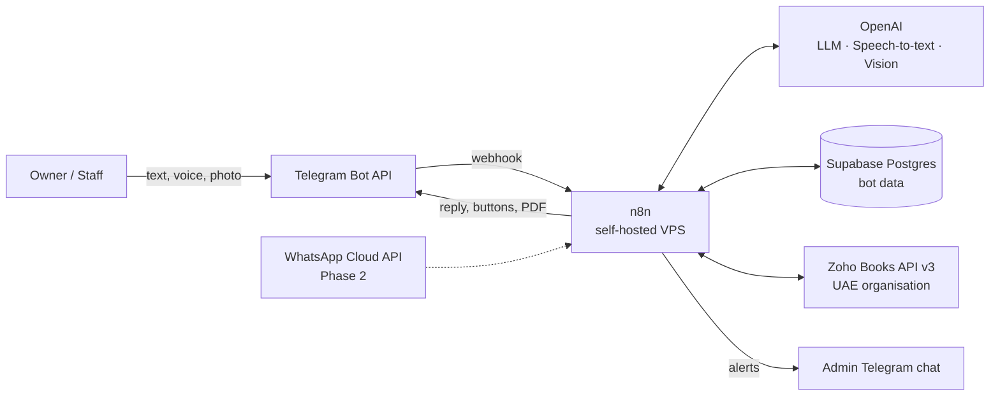
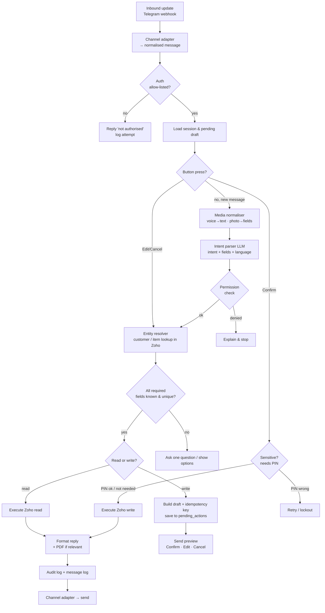

# Architecture — Zoho Books Chat Assistant

| | |
|---|---|
| **Version** | 0.2 (Draft for sign-off) |
| **Date** | 7 October 2026 |
| **Status** | Draft — must be approved before implementation (see `Rules.md`) |
| **Related docs** | `PRD.md`, `milestones.md`, `Rules.md` |

---

## 1. Architecture goals

1. **Zoho Books is the single source of truth** for all accounting data.
2. **Nothing is written without confirmation.** Every write passes through a draft → preview → confirm step.
3. **Channel-independent core.** Telegram now, WhatsApp later, with no change to business logic.
4. **Multi-tenant ready.** One client now, but every record carries a `tenant_id`.
5. **Safe by default.** Allow-list, roles, PIN, audit log, idempotency.
6. **Simple to run.** Small volume, one VPS, modular n8n workflows.

## 2. System context



| Component | Role | Notes |
|---|---|---|
| **Telegram Bot API** | Channel at launch | Webhook mode with secret token header; inline keyboards for Confirm/Edit/Cancel |
| **n8n (self-hosted)** | Orchestration and business logic | Docker on a VPS, behind a reverse proxy (Caddy/Nginx) with HTTPS; its own Postgres for n8n data |
| **OpenAI** | Understanding | Chat model with structured outputs/function calling for intents and fields; speech-to-text for voice; vision model for receipts |
| **Supabase (Postgres)** | Bot's own data | Users, roles, PINs, sessions, drafts, audit/message logs, AI usage. **No accounting data** |
| **Zoho Books API v3** | System of record | OAuth 2.0 (refresh token); org ID per tenant; API domain of the account's data centre |
| **Admin chat** | Operations | Error alerts and daily health summary |

## 3. Request pipeline

Every incoming message goes through the same pipeline:



### Key rules in the pipeline
- **The LLM never calls Zoho directly.** It only returns structured JSON (intent + fields). n8n validates the JSON against a schema, then calls Zoho.
- **Permission check happens twice:** after intent parsing, and again just before executing a write.
- **Draft is the contract.** What the user confirmed (the stored draft) is exactly what gets sent to Zoho. It is never re-parsed after Confirm.
- **Idempotency:** each draft has a unique key. Execution is skipped if that key was already executed.

## 4. n8n workflow structure

Modular sub-workflows, called through the **Execute Workflow** node. Naming: `WF-<nn> <Name>`.

| ID | Workflow | Responsibility |
|---|---|---|
| WF-00 | Telegram Inbound | Webhook trigger, verify secret, hand off to the adapter |
| WF-01 | Channel Adapter | Telegram ⇄ normalised message format (later: WhatsApp adapter) |
| WF-02 | Auth & Session | Allow-list, role, lockout, load/save session |
| WF-03 | Media Normaliser | Download file, speech-to-text, receipt extraction |
| WF-04 | Intent Parser | LLM call with intent catalogue and JSON schema; language detection |
| WF-05 | Entity Resolver | Search customers/items/invoices in Zoho; disambiguation |
| WF-06 | Draft & Confirm | Build preview, store pending action, handle Confirm/Edit/Cancel, PIN check |
| WF-07 | Router | Send a validated intent to the right domain workflow |
| WF-08 | PIN Handler | The only workflow that receives a PIN: delete message, verify or set up, return result only (CR-010) |
| WF-10 | Customers | Create, update, get, search, balance |
| WF-11 | Items | Create, update, get, search |
| WF-12 | Quotations | Create, update, get, list, status, convert, PDF |
| WF-13 | Invoices | Create, update, get, list, void, PDF |
| WF-14 | Payments | Record, get, receipt PDF |
| WF-15 | Expenses | Create, attach receipt |
| WF-20 | Reports | Run report, render/export PDF/Excel |
| WF-30 | Scheduled Reports *(Should)* | Cron → reports → send |
| WF-40 | User Admin | Add/remove user, role, PIN reset |
| WF-90 | Error Handler | n8n error trigger → log → user message → admin alert |
| WF-91 | Zoho Auth | Get/refresh access token, cache until expiry |
| WF-92 | Zoho Client | One shared HTTP wrapper: org ID, retries, backoff on 429/5xx, error mapping |
| WF-93 | Housekeeping | Expire drafts, purge old logs, daily health summary |
| WF-94 | Draft Expiry | Every 5 min: expire drafts, remove stale buttons, notify the user (CR-014) |

**Rule:** domain workflows (WF-10…WF-20) never talk to Telegram, and channel workflows never talk to Zoho. This keeps WhatsApp a drop-in addition.

## 5. Normalised message format

```json
{
  "tenant_id": "uuid",
  "channel": "telegram",
  "channel_user_id": "123456789",
  "chat_id": "123456789",
  "message_id": "987",
  "type": "text | voice | photo | document | button",
  "text": "Invoice Al Noor for 3 hours consulting",
  "media": { "file_id": "...", "mime": "audio/ogg" },
  "button": { "action": "confirm | edit | cancel | pick", "ref": "pending_action_id" },
  "language_hint": "en",
  "received_at": "2026-10-04T10:00:00Z"
}
```

## 6. Data model (Supabase)

All tables have `id`, `tenant_id`, `created_at` and `updated_at` unless noted. Row Level Security is on, and only n8n's service role can access the tables.

| Table | Key columns | Purpose |
|---|---|---|
| `tenants` | name, country, base_currency, timezone, status | One row per client business |
| `zoho_connections` | tenant_id, org_id, api_domain, client_id, refresh_token_enc, access_token_enc, expires_at | Zoho OAuth per tenant (tokens encrypted) |
| `users` | tenant_id, channel, channel_user_id, display_name, role, pin_hash, pin_failed_count, locked_until, preferred_language, status | Allow-list + roles |
| `role_permissions` | role, intent, allowed, needs_pin | Permission matrix as data (not hard-coded) |
| `sessions` | user_id, state (json), last_intent, expires_at | Multi-step conversation state |
| `pending_actions` | user_id, intent, payload (json), preview_text, idempotency_key (unique), status (pending/confirmed/executed/cancelled/expired/failed), zoho_record_id, expires_at | Drafts awaiting confirmation |
| `audit_log` | user_id, intent, zoho_entity, zoho_record_id, action, result, error, pending_action_id | Permanent record of every action |
| `message_log` | user_id, direction, type, text, transcript, ai_tokens | Conversation history (90-day retention) |
| `ai_usage` | user_id, model, purpose, input_tokens, output_tokens, cost_usd | Cost tracking |
| `error_log` | workflow, node, error, payload_ref | Debugging |
| `scheduled_reports` *(Should)* | tenant_id, user_id, report, frequency, format, next_run_at | Scheduled delivery |
| `entity_cache` *(optional)* | tenant_id, entity, zoho_id, name, aliases, refreshed_at | Faster name lookups (refreshed from Zoho) |

## 7. Roles and permissions (proposal — to be confirmed by the client)

| Intent group | Owner | Staff | PIN |
|---|---|---|---|
| Customers: add/update/view/search | ✅ | ✅ | — |
| Customer balance | ✅ | ✅ | — |
| Items: add/update/view/search | ✅ | ✅ | — |
| Quotations: create/update/view/list/status/PDF | ✅ | ✅ | — |
| Convert quotation → invoice | ✅ | ✅ | — |
| Invoices: create/update/view/list/PDF | ✅ | ✅ | — |
| Void invoice | ✅ | ❌ | ✅ |
| Record payment | ✅ | ❌ (configurable) | ✅ |
| Expenses: create | ✅ | ✅ | — |
| Financial reports | ✅ | ❌ (configurable) | ✅ |
| User admin | ✅ | ❌ | ✅ |
| Audit summary | ✅ | ❌ | — |

Permissions are stored in `role_permissions`, so changing them is a data change, not a code change.

## 8. Intent catalogue (MVP)

`help`, `cancel`, `customer.create`, `customer.update`, `customer.get`, `customer.search`, `customer.balance`, `item.create`, `item.update`, `item.get`, `item.search`, `quote.create`, `quote.update`, `quote.get`, `quote.list`, `quote.mark_accepted`, `quote.mark_declined`, `quote.convert_to_invoice`, `quote.pdf`, `invoice.create`, `invoice.update`, `invoice.get`, `invoice.list`, `invoice.void`, `invoice.pdf`, `payment.create`, `payment.get`, `payment.receipt_pdf`, `expense.create`, `report.run`, `user.add`, `user.remove`, `user.set_role`, `user.reset_pin`, `audit.summary`.

**Should (M11):** `report.schedule` (Owner + PIN, CR-017).

Intents for later milestones are seeded **inactive** and activated by their milestone's first migration; inactive intents are denied and not offered to the LLM (CR-017).

Each intent has a **JSON schema** listing required and optional fields. The schema is used both in the LLM prompt and by n8n validation.

## 9. Zoho Books integration

| Topic | Design |
|---|---|
| Auth | OAuth 2.0 server-based client. Store the refresh token encrypted. WF-91 caches the access token until expiry, then refreshes it |
| Org | `organization_id` from `zoho_connections` on every call |
| API domain | Use the domain of the data centre where the org is created. Confirm at signup |
| Core endpoints | `/contacts`, `/items`, `/estimates`, `/invoices`, `/customerpayments`, `/expenses` (+ receipt attachment), report endpoints, `?accept=pdf` for PDFs |
| Rate limits | Zoho applies per-minute and daily call limits that depend on the plan. WF-92 retries 429/5xx with exponential backoff (max 3) and alerts when daily usage passes 80% |
| UAE VAT | Customers carry **tax treatment** and **place of supply (emirate)** as the UAE edition requires. Items default to the VAT 5% tax ID. Zero-rated/exempt handled via tax IDs set up in Zoho |
| Multi-currency | Customer currency drives document currency. Zoho Books applies exchange rates; the bot can show and override the rate in the preview |
| Templates | Bilingual EN/AR templates configured in Zoho Books; the bot requests PDFs with the default template |
| Numbering | Zoho Books auto-numbering (the bot never sets numbers) |
| Errors | Zoho error codes are mapped to friendly messages in the user's language |

## 10. AI design

| Area | Design |
|---|---|
| Intent parsing | One LLM call per user turn, with system prompt + intent catalogue + JSON schema + short session context. Structured output only |
| Language | The model returns the detected language; replies use templates per language (EN/AR/UR/Roman Urdu) plus LLM for free-form answers |
| Voice | Speech-to-text, then the same pipeline. The transcript is shown in the preview |
| Receipts | Vision model extracts vendor, date, total, VAT, currency, TRN; the user confirms |
| Guardrails | Model output is validated against the schema; numbers are recomputed by n8n (totals and VAT are never trusted from the LLM); prompt-injection text inside messages or images is treated as data |
| Test set | 100+ labelled sample messages across 4 languages, re-run after any prompt change |
| Cost | Every call is logged in `ai_usage` |

## 11. Security

- Telegram webhook verified with `X-Telegram-Bot-Api-Secret-Token`.
- HTTPS only. The n8n editor sits behind auth and an IP allow-list or VPN.
- Secrets live in n8n credentials and environment variables, never in workflow JSON.
- Zoho tokens are encrypted at rest (pgcrypto / app-level key).
- PINs are hashed (bcrypt/argon2), with lockout after 5 failures.
- Supabase uses RLS; only the service role key (held by n8n) can access data.
- Least-privilege Zoho user for the API connection, where possible.
- Logs never contain PINs or tokens.
- OpenAI processing is disclosed to the client and agreed in writing.

## 12. Reliability and operations

| Area | Design |
|---|---|
| Idempotency | Unique `idempotency_key` per pending action; execution is skipped if it was already executed |
| Retries | WF-92 backoff for Zoho; Telegram send retries |
| Error handling | WF-90: log → friendly message to the user → alert to the admin chat |
| Backups | Daily dump of n8n Postgres + Supabase, kept 14 days, off-server copy; restore tested |
| Monitoring | Uptime check on the webhook URL; daily health summary (messages, actions, errors, AI cost, Zoho calls) |
| Versioning | n8n workflows exported to Git after every change; prompts and schemas versioned in Git |
| Environments | **DEV** (test Zoho org + test bot) → **PROD** (client org + client bot). Never test against the client's live org |

## 13. Extensibility

- **WhatsApp:** add WF-00b (WhatsApp Inbound) and a WhatsApp branch in WF-01. Business logic stays the same. Requires the Meta WhatsApp Business Platform (Cloud API), a verified business, and approved templates for messages outside the 24-hour window.
- **SaaS:** add a tenant onboarding flow (Zoho OAuth connect per tenant), billing, and an admin panel. The data model already supports it.
- **More Zoho modules (Should/Could):** new domain workflow + new intents + schemas; the pipeline is unchanged.
- **UAE e-invoicing:** handled inside Zoho Books via its accredited service provider integration. The bot only needs to show e-invoice status and handle any new required fields.

## 14. Architecture decision log (ADR summary)

| ADR | Decision | Reason |
|---|---|---|
| ADR-01 | n8n self-hosted on a VPS | Cost and control; path to SaaS |
| ADR-02 | Supabase for bot data | Roles, PINs, state, and audit need a real database; SaaS-ready |
| ADR-03 | OpenAI for text, voice, and vision | One provider; good Arabic/Urdu coverage |
| ADR-04 | Confirm every write | Accuracy and trust outweigh speed |
| ADR-05 | LLM returns JSON only; n8n calls Zoho | Safety, testability |
| ADR-06 | Channel adapter layer | WhatsApp later without rework |
| ADR-07 | No delete via chat; void only | Protect accounting records |
| ADR-08 | Permissions stored as data | Change roles without redeploying |

New decisions are added here only through the change process in `Rules.md`.

## 15. Open technical questions

| # | Question | Status |
|---|---|---|
| T1 | Zoho Books plan and data centre for the UAE org | Open |
| T2 | Exact Zoho report endpoints and export formats available on the chosen plan | Open — verify in M1 |
| T3 | Supabase hosted vs self-hosted on the same VPS | Open |
| T4 | VPS provider/region (latency to Zoho DC and Telegram) | Open |
| T5 | E-invoicing: fields Zoho will require once the client is onboarded | Open — depends on revenue band |

## Change history

| Version | Date | Change | CR | By |
|---|---|---|---|---|
| 0.1 | 2026-10-04 | Initial draft | — | Architect |
| 0.2 | 2026-10-07 | §4: WF-08 PIN Handler, WF-94 Draft Expiry; §8: `report.schedule`, inactive future intents | CR-010, CR-014, CR-017 | Architect |
