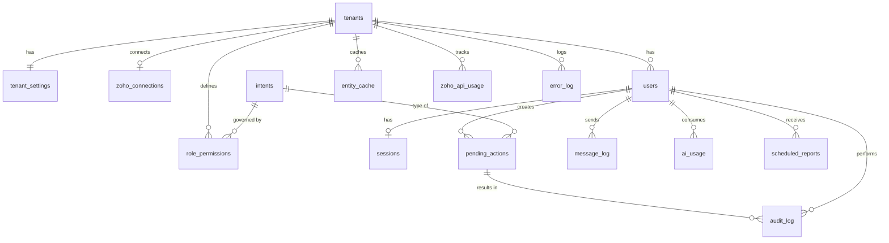

# Database — Zoho Books Chat Assistant

| | |
|---|---|
| **Version** | 0.1 (Draft for sign-off) |
| **Date** | 4 October 2026 |
| **Database** | Supabase (PostgreSQL 15+) |
| **Owner** | Architect (design) · Implementer (migrations) |
| **Related docs** | `Architecture.md` §6, `Workflows.md`, `Rules.md` |

> **What lives here:** only the bot's own data: users, roles, PINs, conversation state, drafts, logs, and usage.
> **What does NOT live here:** accounting data. Customers, invoices, payments, etc. stay in **Zoho Books** (the only exception is an optional name cache used to speed up lookups).
>
> Any change to this file follows the Gap Protocol and Change process in `Rules.md`. The SQL below is the approved design. The Implementer turns it into migration files (`supabase/migrations/`) and must not change it without a Change Request.

---

## 1. Entity relationship diagram



## 2. Table summary

| Table | Purpose | Retention |
|---|---|---|
| `tenants` | One row per client business | Permanent |
| `tenant_settings` | Configurable limits (draft expiry, PIN lockout, retention) | Permanent |
| `zoho_connections` | Zoho org + encrypted OAuth tokens per tenant | Permanent |
| `users` | Allow-list, role, PIN hash, language | Permanent (disabled, not deleted) |
| `intents` | Catalogue of everything the bot can do | Permanent (reference) |
| `role_permissions` | Who can do which intent, and whether a PIN is needed | Permanent |
| `sessions` | Multi-step conversation state per user | Expires (default 60 min) |
| `pending_actions` | Drafts waiting for Confirm; idempotency | 7 days after final status |
| `audit_log` | Permanent record of every action (append-only) | 5 years (confirm with accountant) |
| `message_log` | Conversation history | 90 days |
| `ai_usage` | OpenAI cost tracking | 2 years |
| `error_log` | Workflow errors | 180 days |
| `zoho_api_usage` | Daily Zoho API call counter | 1 year |
| `scheduled_reports` | Scheduled report subscriptions *(Should)* | Permanent |
| `entity_cache` | Optional name lookup cache for customers/items/vendors | Refreshed from Zoho |

## 3. Conventions

- Primary keys: `uuid` (`gen_random_uuid()`); high-volume logs use `bigint generated always as identity`.
- Every tenant-owned table has `tenant_id` (SaaS-ready). **Every query must filter by `tenant_id`.**
- Timestamps: `timestamptz`, stored in UTC; shown in the tenant's timezone (`Asia/Dubai`).
- `created_at` / `updated_at` on mutable tables; `updated_at` maintained by a trigger.
- Money is **never** stored here (it lives in Zoho Books).
- Secrets: PINs are **hashed** (bcrypt). Zoho tokens are **encrypted** with `pgp_sym_encrypt`, using a key held only in the n8n environment (`DB_ENCRYPTION_KEY`), never in the database.
- Row Level Security is **enabled on every table with no policies**, so only the `service_role` key (held by n8n) can read or write.
- Migration file names: `supabase/migrations/<YYYYMMDDHHMM>_<description>.sql`.

---

## 4. Schema (SQL)

### 4.1 Extensions and types — `0001_extensions_types.sql`

```sql
create extension if not exists pgcrypto;
create extension if not exists pg_trgm;

create type tenant_status   as enum ('active', 'suspended', 'closed');
create type channel_type    as enum ('telegram', 'whatsapp');
create type user_role       as enum ('owner', 'staff');
create type user_status     as enum ('invited', 'active', 'disabled');
create type pending_status  as enum ('pending', 'confirmed', 'executing', 'executed', 'cancelled', 'expired', 'failed');
create type msg_direction   as enum ('inbound', 'outbound');
create type action_result   as enum ('success', 'failed', 'denied', 'cancelled');
create type report_frequency as enum ('daily', 'weekly', 'monthly');
create type report_format   as enum ('pdf', 'xlsx');

create or replace function set_updated_at() returns trigger
language plpgsql as $$
begin
  new.updated_at := now();
  return new;
end $$;
```

### 4.2 Tenants and Zoho connection — `0002_tenants.sql`

```sql
create table tenants (
  id               uuid primary key default gen_random_uuid(),
  name             text not null,
  country_code     char(2) not null default 'AE',
  base_currency    char(3) not null default 'AED',
  timezone         text not null default 'Asia/Dubai',
  default_language text not null default 'en' check (default_language in ('en','ar','ur','ur-Latn')),
  status           tenant_status not null default 'active',
  created_at       timestamptz not null default now(),
  updated_at       timestamptz not null default now()
);
create trigger trg_tenants_updated before update on tenants for each row execute function set_updated_at();

create table tenant_settings (
  tenant_id                   uuid primary key references tenants(id) on delete cascade,
  draft_ttl_minutes           int  not null default 30  check (draft_ttl_minutes between 5 and 240),
  session_ttl_minutes         int  not null default 60  check (session_ttl_minutes between 5 and 1440),
  pin_max_attempts            int  not null default 5   check (pin_max_attempts between 3 and 10),
  pin_lockout_minutes         int  not null default 15  check (pin_lockout_minutes between 5 and 1440),
  draft_retention_days        int  not null default 7,
  message_log_retention_days  int  not null default 90,
  error_log_retention_days    int  not null default 180,
  audit_retention_years       int  not null default 5,
  admin_alert_chat_id         text,             -- Telegram chat that receives error alerts
  zoho_daily_call_limit       int,              -- from the Zoho plan; used for the 80% alert
  created_at                  timestamptz not null default now(),
  updated_at                  timestamptz not null default now()
);
create trigger trg_tenant_settings_updated before update on tenant_settings for each row execute function set_updated_at();

create table zoho_connections (
  id                      uuid primary key default gen_random_uuid(),
  tenant_id               uuid not null unique references tenants(id) on delete cascade,
  organization_id         text not null,
  api_domain              text not null,      -- e.g. https://www.zohoapis.com (data-centre specific)
  accounts_domain         text not null,      -- e.g. https://accounts.zoho.com
  client_id               text not null,
  client_secret_enc       bytea not null,
  refresh_token_enc       bytea not null,
  access_token_enc        bytea,
  access_token_expires_at timestamptz,
  scopes                  text,
  status                  text not null default 'active' check (status in ('active','revoked','error')),
  last_refreshed_at       timestamptz,
  last_error              text,
  created_at              timestamptz not null default now(),
  updated_at              timestamptz not null default now()
);
create trigger trg_zoho_conn_updated before update on zoho_connections for each row execute function set_updated_at();
```

### 4.3 Users, intents, and permissions — `0003_users_permissions.sql`

```sql
create table users (
  id                 uuid primary key default gen_random_uuid(),
  tenant_id          uuid not null references tenants(id) on delete cascade,
  channel            channel_type not null,
  channel_user_id    text not null,              -- Telegram user id / WhatsApp phone (E.164)
  chat_id            text,                       -- where replies are sent
  display_name       text not null,
  phone              text,
  role               user_role not null default 'staff',
  status             user_status not null default 'active',
  pin_hash           text,                       -- bcrypt; null = PIN not set yet
  pin_set_at         timestamptz,
  pin_failed_count   int not null default 0,
  locked_until       timestamptz,
  preferred_language text check (preferred_language in ('en','ar','ur','ur-Latn')),
  zoho_user_id       text,                       -- optional: matching Zoho Books user
  last_seen_at       timestamptz,
  created_by         uuid references users(id),
  created_at         timestamptz not null default now(),
  updated_at         timestamptz not null default now(),
  unique (tenant_id, channel, channel_user_id)
);
create index idx_users_channel_lookup on users (channel, channel_user_id) where status = 'active';
create trigger trg_users_updated before update on users for each row execute function set_updated_at();

-- At least one active owner per tenant is enforced in WF-40 (User Admin) and checked by a view below.

create table intents (
  code        text primary key,                  -- e.g. 'invoice.create'
  domain      text not null,                     -- customer, item, quote, invoice, payment, expense, report, user, system
  description text not null,
  is_write    boolean not null,                  -- true = needs preview + Confirm
  milestone   text not null,                     -- M2..M15
  active      boolean not null default true
);

create table role_permissions (
  id         uuid primary key default gen_random_uuid(),
  tenant_id  uuid not null references tenants(id) on delete cascade,
  role       user_role not null,
  intent     text not null references intents(code),
  allowed    boolean not null default false,
  needs_pin  boolean not null default false,
  updated_by uuid references users(id),
  updated_at timestamptz not null default now(),
  unique (tenant_id, role, intent)
);
create trigger trg_role_perm_updated before update on role_permissions for each row execute function set_updated_at();
```

### 4.4 Conversation state and drafts — `0004_sessions_drafts.sql`

```sql
create table sessions (
  id          uuid primary key default gen_random_uuid(),
  tenant_id   uuid not null references tenants(id) on delete cascade,
  user_id     uuid not null unique references users(id) on delete cascade,
  state       jsonb not null default '{}'::jsonb,   -- current step, collected fields, options shown
  last_intent text references intents(code),
  language    text,
  expires_at  timestamptz not null,
  created_at  timestamptz not null default now(),
  updated_at  timestamptz not null default now()
);
create trigger trg_sessions_updated before update on sessions for each row execute function set_updated_at();

create table pending_actions (
  id                  uuid primary key default gen_random_uuid(),
  tenant_id           uuid not null references tenants(id) on delete cascade,
  user_id             uuid not null references users(id),
  intent              text not null references intents(code),
  payload             jsonb not null,               -- exact body that will be sent to Zoho (see §6)
  preview_text        text not null,                -- what the user saw
  idempotency_key     text not null unique,
  status              pending_status not null default 'pending',
  needs_pin           boolean not null default false,
  pin_verified_at     timestamptz,
  channel_message_id  text,                         -- preview message id (to edit buttons later)
  zoho_entity         text,                         -- 'invoice', 'estimate', 'contact', ...
  zoho_record_id      text,
  zoho_record_number  text,                         -- e.g. INV-000123
  error               jsonb,
  expires_at          timestamptz not null,
  confirmed_at        timestamptz,
  executed_at         timestamptz,
  created_at          timestamptz not null default now(),
  updated_at          timestamptz not null default now()
);
create index idx_pending_user_status on pending_actions (user_id, status);
create index idx_pending_expiry on pending_actions (expires_at) where status in ('pending','confirmed');
create trigger trg_pending_updated before update on pending_actions for each row execute function set_updated_at();
```

### 4.5 Logs and usage — `0005_logs.sql`

```sql
create table audit_log (
  id                 bigint generated always as identity primary key,
  tenant_id          uuid not null references tenants(id),
  user_id            uuid references users(id),
  pending_action_id  uuid references pending_actions(id),
  intent             text not null,
  action             text not null,          -- create, update, void, read, pdf, login_failed, user_added ...
  zoho_entity        text,
  zoho_record_id     text,
  zoho_record_number text,
  result             action_result not null,
  details            jsonb,                  -- small summary only; never PINs or tokens
  error              text,
  created_at         timestamptz not null default now()
);
create index idx_audit_tenant_time on audit_log (tenant_id, created_at desc);
create index idx_audit_user_time   on audit_log (user_id, created_at desc);

-- audit_log is append-only
create or replace function prevent_audit_change() returns trigger
language plpgsql as $$
begin
  if tg_op = 'DELETE' and current_setting('app.retention_job', true) = 'on' then
    return old;  -- allowed only for the retention job
  end if;
  raise exception 'audit_log is append-only';
end $$;
create trigger trg_audit_no_update before update or delete on audit_log
  for each row execute function prevent_audit_change();

create table message_log (
  id              bigint generated always as identity primary key,
  tenant_id       uuid not null references tenants(id),
  user_id         uuid references users(id),        -- null for unknown senders
  channel         channel_type not null,
  channel_user_id text not null,
  direction       msg_direction not null,
  message_type    text not null check (message_type in ('text','voice','photo','document','button','system')),
  text            text,
  transcript      text,
  media_ref       text,                             -- channel file id (file itself not stored)
  intent          text,
  language        text,
  created_at      timestamptz not null default now()
);
create index idx_msglog_tenant_time on message_log (tenant_id, created_at desc);

create table ai_usage (
  id             bigint generated always as identity primary key,
  tenant_id      uuid not null references tenants(id),
  user_id        uuid references users(id),
  model          text not null,
  purpose        text not null check (purpose in ('intent','transcription','vision','reply','other')),
  input_tokens   int not null default 0,
  output_tokens  int not null default 0,
  audio_seconds  numeric(10,2),
  cost_usd       numeric(12,6) not null default 0,
  created_at     timestamptz not null default now()
);
create index idx_ai_usage_tenant_time on ai_usage (tenant_id, created_at desc);

create table error_log (
  id             bigint generated always as identity primary key,
  tenant_id      uuid references tenants(id),
  workflow       text not null,          -- e.g. 'WF-13 Invoices'
  node           text,
  execution_id   text,
  error_message  text not null,
  error_details  jsonb,
  created_at     timestamptz not null default now()
);
create index idx_error_log_time on error_log (created_at desc);

create table zoho_api_usage (
  tenant_id  uuid not null references tenants(id) on delete cascade,
  day        date not null,
  calls      int not null default 0,
  primary key (tenant_id, day)
);
```

### 4.6 Scheduled reports and cache — `0006_reports_cache.sql`

```sql
create table scheduled_reports (               -- Should-have (M11)
  id           uuid primary key default gen_random_uuid(),
  tenant_id    uuid not null references tenants(id) on delete cascade,
  user_id      uuid not null references users(id) on delete cascade,
  report_code  text not null,                  -- 'profit_and_loss', 'receivables_aging', 'sales_by_customer', 'expense_summary', 'daily_summary'
  frequency    report_frequency not null,
  format       report_format not null default 'pdf',
  day_of_week  smallint check (day_of_week between 1 and 7),    -- weekly (1 = Monday)
  day_of_month smallint check (day_of_month between 1 and 28),  -- monthly
  send_time    time not null default '08:00',
  next_run_at  timestamptz not null,
  last_run_at  timestamptz,
  active       boolean not null default true,
  created_at   timestamptz not null default now(),
  updated_at   timestamptz not null default now()
);
create index idx_sched_due on scheduled_reports (next_run_at) where active;
create trigger trg_sched_updated before update on scheduled_reports for each row execute function set_updated_at();

create table entity_cache (                    -- optional: fast fuzzy lookup; Zoho remains the source of truth
  id           uuid primary key default gen_random_uuid(),
  tenant_id    uuid not null references tenants(id) on delete cascade,
  entity       text not null check (entity in ('customer','item','vendor','account','tax','currency')),
  zoho_id      text not null,
  name         text not null,
  aliases      text[] not null default '{}',
  extra        jsonb not null default '{}'::jsonb,   -- e.g. currency_code, rate, tax_id
  active       boolean not null default true,
  refreshed_at timestamptz not null default now(),
  unique (tenant_id, entity, zoho_id)
);
create index idx_cache_name_trgm on entity_cache using gin (name gin_trgm_ops);
```

### 4.7 Security — `0007_rls.sql`

```sql
do $$
declare t text;
begin
  foreach t in array array['tenants','tenant_settings','zoho_connections','users','intents','role_permissions',
                           'sessions','pending_actions','audit_log','message_log','ai_usage','error_log',
                           'zoho_api_usage','scheduled_reports','entity_cache']
  loop
    execute format('alter table %I enable row level security', t);
    execute format('revoke all on %I from anon, authenticated', t);
  end loop;
end $$;
-- No policies are created: only the service_role (used by n8n) bypasses RLS.
```

---

## 5. Functions — `0008_functions.sql`

### 5.1 PIN management

```sql
-- Set or reset a PIN (4–6 digits). Called by WF-40 after Owner approval.
create or replace function set_user_pin(p_user_id uuid, p_pin text) returns void
language plpgsql as $$
begin
  if p_pin !~ '^[0-9]{4,6}$' then
    raise exception 'PIN must be 4 to 6 digits';
  end if;
  update users
     set pin_hash = crypt(p_pin, gen_salt('bf', 10)),
         pin_set_at = now(), pin_failed_count = 0, locked_until = null
   where id = p_user_id;
end $$;

-- Verify a PIN with lockout. Returns {ok, locked, locked_until, attempts_left}.
create or replace function verify_user_pin(p_user_id uuid, p_pin text) returns jsonb
language plpgsql as $$
declare
  u users%rowtype;
  s tenant_settings%rowtype;
begin
  select * into u from users where id = p_user_id for update;
  select * into s from tenant_settings where tenant_id = u.tenant_id;

  if u.locked_until is not null and u.locked_until > now() then
    return jsonb_build_object('ok', false, 'locked', true, 'locked_until', u.locked_until, 'attempts_left', 0);
  end if;

  if u.pin_hash is not null and crypt(p_pin, u.pin_hash) = u.pin_hash then
    update users set pin_failed_count = 0, locked_until = null where id = p_user_id;
    return jsonb_build_object('ok', true, 'locked', false);
  end if;

  if u.pin_failed_count + 1 >= s.pin_max_attempts then
    update users set pin_failed_count = 0,
                     locked_until = now() + make_interval(mins => s.pin_lockout_minutes)
     where id = p_user_id;
    return jsonb_build_object('ok', false, 'locked', true,
                              'locked_until', now() + make_interval(mins => s.pin_lockout_minutes), 'attempts_left', 0);
  end if;

  update users set pin_failed_count = pin_failed_count + 1 where id = p_user_id;
  return jsonb_build_object('ok', false, 'locked', false,
                            'attempts_left', s.pin_max_attempts - (u.pin_failed_count + 1));
end $$;
```

### 5.2 Draft lifecycle and idempotency

```sql
-- Atomically claim a draft for execution. Returns the row only once; a double Confirm returns nothing.
create or replace function claim_pending_action(p_id uuid, p_user_id uuid) returns setof pending_actions
language sql as $$
  update pending_actions
     set status = 'executing', confirmed_at = coalesce(confirmed_at, now())
   where id = p_id
     and user_id = p_user_id
     and status in ('pending','confirmed')
     and expires_at > now()
     and (needs_pin = false or pin_verified_at is not null)
  returning *;
$$;

-- Record the outcome after the Zoho call.
create or replace function complete_pending_action(
  p_id uuid, p_success boolean, p_zoho_entity text, p_zoho_record_id text,
  p_zoho_record_number text, p_error jsonb) returns void
language sql as $$
  update pending_actions
     set status = case when p_success then 'executed'::pending_status else 'failed'::pending_status end,
         executed_at = now(),
         zoho_entity = p_zoho_entity,
         zoho_record_id = p_zoho_record_id,
         zoho_record_number = p_zoho_record_number,
         error = p_error
   where id = p_id and status = 'executing';
$$;
```

### 5.3 Zoho token storage (encrypted)

```sql
-- p_key comes from the n8n environment variable DB_ENCRYPTION_KEY; it is never stored in the database.
create or replace function zoho_save_tokens(p_tenant uuid, p_access text, p_expires_at timestamptz, p_key text) returns void
language sql as $$
  update zoho_connections
     set access_token_enc = pgp_sym_encrypt(p_access, p_key),
         access_token_expires_at = p_expires_at,
         last_refreshed_at = now(), status = 'active', last_error = null
   where tenant_id = p_tenant;
$$;

create or replace function zoho_get_credentials(p_tenant uuid, p_key text) returns jsonb
language sql as $$
  select jsonb_build_object(
    'organization_id', organization_id,
    'api_domain', api_domain,
    'accounts_domain', accounts_domain,
    'client_id', client_id,
    'client_secret', pgp_sym_decrypt(client_secret_enc, p_key),
    'refresh_token', pgp_sym_decrypt(refresh_token_enc, p_key),
    'access_token', case when access_token_enc is null then null else pgp_sym_decrypt(access_token_enc, p_key) end,
    'access_token_expires_at', access_token_expires_at)
  from zoho_connections where tenant_id = p_tenant and status = 'active';
$$;
```

### 5.4 Permission check and usage counters

```sql
create or replace function check_permission(p_user_id uuid, p_intent text) returns jsonb
language sql stable as $$
  select coalesce(
    (select jsonb_build_object('allowed', rp.allowed and u.status = 'active', 'needs_pin', rp.needs_pin)
       from users u
       join role_permissions rp on rp.tenant_id = u.tenant_id and rp.role = u.role and rp.intent = p_intent
      where u.id = p_user_id),
    jsonb_build_object('allowed', false, 'needs_pin', false));   -- default deny
$$;

create or replace function increment_zoho_usage(p_tenant uuid) returns int
language sql as $$
  insert into zoho_api_usage (tenant_id, day, calls) values (p_tenant, current_date, 1)
  on conflict (tenant_id, day) do update set calls = zoho_api_usage.calls + 1
  returning calls;
$$;
```

### 5.5 Housekeeping (called daily by WF-93)

```sql
create or replace function run_housekeeping() returns jsonb
language plpgsql as $$
declare r jsonb := '{}'::jsonb; n int;
begin
  update pending_actions set status = 'expired'
   where status in ('pending','confirmed') and expires_at < now();
  get diagnostics n = row_count; r := r || jsonb_build_object('drafts_expired', n);

  delete from pending_actions pa using tenant_settings s
   where pa.tenant_id = s.tenant_id
     and pa.status in ('executed','cancelled','expired','failed')
     and pa.updated_at < now() - make_interval(days => s.draft_retention_days)
     and not exists (select 1 from audit_log a where a.pending_action_id = pa.id);
  get diagnostics n = row_count; r := r || jsonb_build_object('drafts_deleted', n);

  delete from sessions where expires_at < now();
  get diagnostics n = row_count; r := r || jsonb_build_object('sessions_deleted', n);

  delete from message_log m using tenant_settings s
   where m.tenant_id = s.tenant_id and m.created_at < now() - make_interval(days => s.message_log_retention_days);
  get diagnostics n = row_count; r := r || jsonb_build_object('messages_deleted', n);

  delete from error_log e using tenant_settings s
   where e.tenant_id = s.tenant_id and e.created_at < now() - make_interval(days => s.error_log_retention_days);
  get diagnostics n = row_count; r := r || jsonb_build_object('errors_deleted', n);

  perform set_config('app.retention_job', 'on', true);
  delete from audit_log a using tenant_settings s
   where a.tenant_id = s.tenant_id and a.created_at < now() - make_interval(years => s.audit_retention_years);
  get diagnostics n = row_count; r := r || jsonb_build_object('audit_deleted', n);

  return r;
end $$;
```

> Note: drafts that are referenced by `audit_log` are kept so the audit trail stays complete. If storage becomes an issue, archive them instead (raise a GAP first).

## 6. Views

```sql
-- Daily health summary used by WF-93
create or replace view v_daily_health as
select t.id as tenant_id, t.name,
  (select count(*) from message_log m where m.tenant_id = t.id and m.created_at >= current_date) as messages_today,
  (select count(*) from audit_log a where a.tenant_id = t.id and a.created_at >= current_date and a.result = 'success') as actions_ok_today,
  (select count(*) from audit_log a where a.tenant_id = t.id and a.created_at >= current_date and a.result = 'failed')  as actions_failed_today,
  (select count(*) from error_log e where e.tenant_id = t.id and e.created_at >= current_date) as errors_today,
  (select coalesce(sum(cost_usd),0) from ai_usage u where u.tenant_id = t.id and u.created_at >= current_date) as ai_cost_usd_today,
  (select coalesce(calls,0) from zoho_api_usage z where z.tenant_id = t.id and z.day = current_date) as zoho_calls_today
from tenants t where t.status = 'active';

-- Tenants that have no active owner (must always be empty)
create or replace view v_tenants_without_owner as
select t.id, t.name from tenants t
where not exists (select 1 from users u where u.tenant_id = t.id and u.role = 'owner' and u.status = 'active');
```

## 7. Seed data — `0009_seed.sql`

### 7.1 Intent catalogue (MVP + Should)

```sql
insert into intents (code, domain, description, is_write, milestone) values
 ('help','system','Show what the bot can do',false,'M3'),
 ('cancel','system','Cancel the current flow',false,'M3'),
 ('customer.create','customer','Add a customer',true,'M4'),
 ('customer.update','customer','Update a customer',true,'M4'),
 ('customer.get','customer','View a customer',false,'M4'),
 ('customer.search','customer','Search customers',false,'M4'),
 ('customer.balance','customer','Customer outstanding balance',false,'M4'),
 ('item.create','item','Add a service item',true,'M4'),
 ('item.update','item','Update a service item',true,'M4'),
 ('item.get','item','View a service item',false,'M4'),
 ('item.search','item','Search service items / check price',false,'M4'),
 ('quote.create','quote','Create a quotation',true,'M5'),
 ('quote.update','quote','Update a quotation',true,'M5'),
 ('quote.get','quote','View a quotation',false,'M5'),
 ('quote.list','quote','List quotations',false,'M5'),
 ('quote.mark_accepted','quote','Mark quotation accepted',true,'M5'),
 ('quote.mark_declined','quote','Mark quotation declined',true,'M5'),
 ('quote.convert_to_invoice','quote','Convert quotation to invoice',true,'M5'),
 ('quote.pdf','quote','Get quotation PDF',false,'M5'),
 ('invoice.create','invoice','Create an invoice',true,'M5'),
 ('invoice.update','invoice','Update an invoice',true,'M5'),
 ('invoice.get','invoice','View an invoice',false,'M5'),
 ('invoice.list','invoice','List invoices',false,'M5'),
 ('invoice.void','invoice','Void an invoice',true,'M5'),
 ('invoice.pdf','invoice','Get invoice PDF',false,'M5'),
 ('payment.create','payment','Record a customer payment',true,'M6'),
 ('payment.get','payment','View a payment',false,'M6'),
 ('payment.receipt_pdf','payment','Get payment receipt PDF',false,'M6'),
 ('expense.create','expense','Record an expense',true,'M7'),
 ('report.run','report','Run a report',false,'M8'),
 ('user.add','user','Add a user',true,'M2'),
 ('user.remove','user','Disable a user',true,'M2'),
 ('user.set_role','user','Change a user role',true,'M2'),
 ('user.reset_pin','user','Reset a user PIN',true,'M2'),
 ('audit.summary','system','Summary of user activity',false,'M2'),
 ('report.schedule','report','Schedule a report',true,'M11');
```

### 7.2 First tenant and default permissions

```sql
-- Replace values during M1. Real Zoho credentials are inserted by the Implementer with pgp_sym_encrypt, never committed to Git.
with t as (
  insert into tenants (name, country_code, base_currency, timezone, default_language)
  values ('<Client company name>', 'AE', 'AED', 'Asia/Dubai', 'en')
  returning id
)
insert into tenant_settings (tenant_id) select id from t;

-- Default permission matrix (Architecture.md §7). Owner: everything. Staff: no void, payments, reports, user admin, audit.
insert into role_permissions (tenant_id, role, intent, allowed, needs_pin)
select t.id, r.role, i.code,
  case when r.role = 'owner' then true
       else i.code not in ('invoice.void','payment.create','report.run','report.schedule',
                           'user.add','user.remove','user.set_role','user.reset_pin','audit.summary') end,
  i.code in ('invoice.void','payment.create','report.run','user.add','user.remove','user.set_role','user.reset_pin')
from tenants t
cross join (values ('owner'::user_role), ('staff'::user_role)) as r(role)
cross join intents i
where t.name = '<Client company name>';

-- First Owner (Telegram user id collected during onboarding). PIN is set via set_user_pin(), never inline.
insert into users (tenant_id, channel, channel_user_id, chat_id, display_name, role, preferred_language)
select id, 'telegram', '<owner_telegram_user_id>', '<owner_chat_id>', '<Owner name>', 'owner', 'en'
from tenants where name = '<Client company name>';
```

## 8. Payload examples (`pending_actions.payload`)

The payload is the **exact Zoho Books request body** plus a small `meta` block. n8n recalculates totals; the LLM output is never sent as-is.

```json
{
  "meta": { "zoho_endpoint": "POST /invoices", "source_message_id": "987", "language": "en" },
  "body": {
    "customer_id": "4600000000012345",
    "currency_id": "4600000000000101",
    "date": "2026-10-04",
    "payment_terms": 30,
    "line_items": [
      { "item_id": "4600000000020001", "quantity": 3, "rate": 500, "tax_id": "4600000000000301" },
      { "item_id": "4600000000020002", "quantity": 1, "rate": 2000, "tax_id": "4600000000000301" }
    ]
  },
  "computed": { "sub_total": 3500.00, "tax_total": 175.00, "total": 3675.00, "currency": "AED" }
}
```

## 9. Operations

| Task | How |
|---|---|
| Backups | Supabase daily backups (or `pg_dump` cron if self-hosted) → off-server storage, 14-day retention |
| Restore drill | Before go-live (M9) and every 3 months; result recorded in `SelfImprovement.md` |
| Key rotation | `DB_ENCRYPTION_KEY`: re-encrypt `zoho_connections` with a one-off script; requires a CR |
| Monitoring | `v_daily_health` (daily); `v_tenants_without_owner` must return 0 rows |
| Schema changes | Only via a new migration file + CR (`Rules.md` §5); never edit an applied migration |

## 10. Change history

| Version | Date | Change | CR |
|---|---|---|---|
| 0.1 | 2026-10-04 | Initial design | — |
