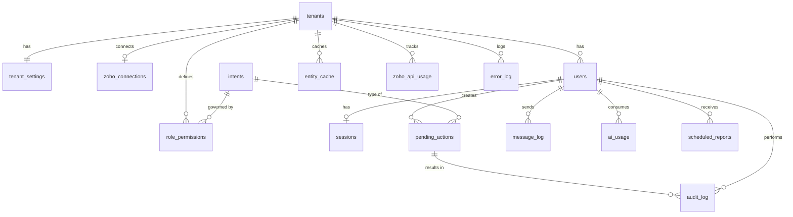

# Database — Zoho Books Chat Assistant

| | |
|---|---|
| **Version** | 0.9 (Draft for sign-off) |
| **Date** | 7 October 2026 |
| **Database** | Supabase (PostgreSQL 15+). Tested version: the major version provisioned for the DEV/PROD Supabase projects, recorded at M1 (CR-007) |
| **Owner** | Architect (design) · Implementer (migrations) |
| **Related docs** | `Architecture.md` §6, `Workflows.md`, `Rules.md` |

> **What lives here:** only the bot's own data: users, roles, PINs, conversation state, drafts, logs, and usage.
> **What does NOT live here:** accounting data. Customers, invoices, payments, etc. stay in **Zoho Books** (the only exception is an optional name cache used to speed up lookups).
>
> Any change to this file follows the Gap Protocol and Change process in `Rules.md`. The SQL below is the approved design. The Implementer turns it into migration files (`supabase/migrations/`) and must not change it without a Change Request.

---

## 1. Entity relationship diagram



## 2. Table summary

| Table | Purpose | Retention |
|---|---|---|
| `tenants` | One row per client business | Permanent |
| `tenant_settings` | Configurable limits (draft expiry, PIN lockout, retention) | Permanent |
| `zoho_connections` | Zoho org + encrypted OAuth tokens per tenant | Permanent |
| `users` | Allow-list, role, PIN hash, language | Permanent (disabled, not deleted) |
| `intents` | Catalogue of everything the bot can do | Permanent (reference) |
| `role_permissions` | Who can do which intent, and whether a PIN is needed | Permanent |
| `sessions` | Multi-step conversation state per user | Expires (default 60 min) |
| `pending_actions` | Drafts waiting for Confirm; idempotency | 7 days after final status: deleted, or redacted if audited (CR-015) |
| `audit_log` | Permanent record of every action (append-only) | 5 years (confirm with accountant) |
| `message_log` | Conversation history | 90 days |
| `ai_usage` | OpenAI cost tracking | 2 years |
| `error_log` | Workflow errors | 180 days |
| `zoho_api_usage` | Daily Zoho API call counter | 1 year |
| `inbound_updates` | De-duplicates channel redeliveries (CR-013) | 2 days |
| `scheduled_reports` | Scheduled report subscriptions *(Should)* | Permanent |
| `entity_cache` | Optional name lookup cache for customers/items/vendors | Refreshed from Zoho |

## 3. Conventions

- Primary keys: `uuid` (`gen_random_uuid()`); high-volume logs use `bigint generated always as identity`.
- Every tenant-owned table has `tenant_id` (SaaS-ready). **Every query must filter by `tenant_id`.**
- Timestamps: `timestamptz`, stored in UTC; shown in the tenant's timezone (`Asia/Dubai`).
- `created_at` / `updated_at` on mutable tables; `updated_at` maintained by a trigger.
- Money is **never** stored here (it lives in Zoho Books).
- Secrets: PINs are **hashed** (bcrypt). Zoho tokens are **encrypted** with `pgp_sym_encrypt`, using a key held only in the n8n environment (`DB_ENCRYPTION_KEY`), never in the database.
- Row Level Security is **enabled on every table with no policies**, so only the `service_role` key (held by n8n) can read or write.
- **New objects start closed (CR-023):** on Supabase a new table in `public` is granted to `anon`, `authenticated`, and `service_role` by default, and views bypass RLS because they run as their owner. So: 0007 revokes the default privileges on tables and sequences from `anon`/`authenticated`; **every migration that creates a table enables RLS on it and revokes `anon`/`authenticated`**; every view is created `with (security_invoker = true)` and revoked from `anon`/`authenticated`. Source: Supabase docs, Row Level Security (views; default privileges).
- Migration file names: `supabase/migrations/<YYYYMMDDHHMM>_<description>.sql`. The `00nn_…sql` labels in this document are logical names only; the **apply order** is the table in the current milestone note (M1 note §3: 0001–0007, 0008 functions, 0008b privileges, 0010 views, 0009 seed last).

---

## 4. Schema (SQL)

### 4.1 Extensions and types — `0001_extensions_types.sql`

```sql
-- CR-020: extensions live in the "extensions" schema (Supabase default). The schema is created if missing
-- (plain Postgres). Callers' search_path must include "extensions" (Supabase default: "$user", public, extensions);
-- any SECURITY DEFINER function with search_path = '' must qualify calls, e.g. extensions.crypt().
-- The actual layout is verified on the provisioned project at M1 (T1).
create schema if not exists extensions;
create extension if not exists pgcrypto with schema extensions;
create extension if not exists pg_trgm  with schema extensions;

create type tenant_status   as enum ('active', 'suspended', 'closed');
create type channel_type    as enum ('telegram', 'whatsapp');
create type user_role       as enum ('owner', 'staff');
create type user_status     as enum ('invited', 'active', 'disabled');
create type pending_status  as enum ('pending', 'confirmed', 'executing', 'executed', 'cancelled', 'expired', 'failed');
create type msg_direction   as enum ('inbound', 'outbound');
create type action_result   as enum ('success', 'failed', 'denied', 'cancelled');
create type report_frequency as enum ('daily', 'weekly', 'monthly');
create type report_format   as enum ('pdf', 'xlsx');

create or replace function set_updated_at() returns trigger
language plpgsql as $$
begin
  new.updated_at := now();
  return new;
end $$;
```

### 4.2 Tenants and Zoho connection — `0002_tenants.sql`

```sql
create table tenants (
  id               uuid primary key default gen_random_uuid(),
  name             text not null,
  country_code     char(2) not null default 'AE',
  base_currency    char(3) not null default 'AED',
  timezone         text not null default 'Asia/Dubai',
  default_language text not null default 'en' check (default_language in ('en','ar','ur','ur-Latn')),
  status           tenant_status not null default 'active',
  created_at       timestamptz not null default now(),
  updated_at       timestamptz not null default now()
);
create trigger trg_tenants_updated before update on tenants for each row execute function set_updated_at();

create table tenant_settings (
  tenant_id                   uuid primary key references tenants(id) on delete cascade,
  draft_ttl_minutes           int  not null default 30  check (draft_ttl_minutes between 5 and 240),
  session_ttl_minutes         int  not null default 60  check (session_ttl_minutes between 5 and 1440),
  pin_max_attempts            int  not null default 5   check (pin_max_attempts between 3 and 10),
  pin_lockout_minutes         int  not null default 15  check (pin_lockout_minutes between 5 and 1440),
  draft_retention_days        int  not null default 7,
  message_log_retention_days  int  not null default 90,
  error_log_retention_days    int  not null default 180,
  audit_retention_years       int  not null default 5,
  admin_alert_chat_id         text,             -- Telegram chat that receives error alerts
  zoho_daily_call_limit       int,              -- from the Zoho plan; used for the 80% alert
  created_at                  timestamptz not null default now(),
  updated_at                  timestamptz not null default now()
);
create trigger trg_tenant_settings_updated before update on tenant_settings for each row execute function set_updated_at();

create table zoho_connections (
  id                      uuid primary key default gen_random_uuid(),
  tenant_id               uuid not null unique references tenants(id) on delete cascade,
  organization_id         text not null,
  api_domain              text not null,      -- e.g. https://www.zohoapis.com (data-centre specific)
  accounts_domain         text not null,      -- e.g. https://accounts.zoho.com
  client_id               text not null,
  client_secret_enc       bytea not null,
  refresh_token_enc       bytea not null,
  access_token_enc        bytea,
  access_token_expires_at timestamptz,
  scopes                  text,
  status                  text not null default 'active' check (status in ('active','revoked','error')),
  last_refreshed_at       timestamptz,
  last_error              text,
  refresh_lock_until      timestamptz,        -- single-flight token refresh claim (CR-002)
  last_alert_at           timestamptz,        -- last refresh-failure admin alert; null = never (CR-002 rev 3)
  created_at              timestamptz not null default now(),
  updated_at              timestamptz not null default now()
);
create trigger trg_zoho_conn_updated before update on zoho_connections for each row execute function set_updated_at();
```

### 4.3 Users, intents, and permissions — `0003_users_permissions.sql`

```sql
create table users (
  id                 uuid primary key default gen_random_uuid(),
  tenant_id          uuid not null references tenants(id) on delete cascade,
  channel            channel_type not null,
  channel_user_id    text not null,              -- Telegram user id / WhatsApp phone (E.164)
  chat_id            text,                       -- where replies are sent
  display_name       text not null,
  phone              text,
  role               user_role not null default 'staff',
  status             user_status not null default 'active',   -- 'invited' unused in Phase 1 (kept for M15); setup is driven by pin_hash (CR-012)
  pin_hash           text,                       -- bcrypt; null = PIN not set yet → user can only do PIN setup (CR-012)
  pin_pending_hash   text,                       -- bcrypt of the first setup entry, until confirmed (CR-012)
  pin_set_at         timestamptz,
  pin_failed_count   int not null default 0,
  locked_until       timestamptz,
  preferred_language text check (preferred_language in ('en','ar','ur','ur-Latn')),
  zoho_user_id       text,                       -- optional: matching Zoho Books user
  last_seen_at       timestamptz,
  created_by         uuid references users(id),
  created_at         timestamptz not null default now(),
  updated_at         timestamptz not null default now(),
  unique (tenant_id, channel, channel_user_id)
);
create index idx_users_channel_lookup on users (channel, channel_user_id) where status = 'active';
create trigger trg_users_updated before update on users for each row execute function set_updated_at();

-- At least one active owner per tenant is enforced in WF-40 (User Admin) and checked by a view below.

create table intents (
  code        text primary key,                  -- e.g. 'invoice.create'
  domain      text not null,                     -- customer, item, quote, invoice, payment, expense, report, user, system
  description text not null,
  is_write    boolean not null,                  -- true = needs preview + Confirm
  milestone   text not null,                     -- M2..M15
  active      boolean not null default true
);

create table role_permissions (
  id         uuid primary key default gen_random_uuid(),
  tenant_id  uuid not null references tenants(id) on delete cascade,
  role       user_role not null,
  intent     text not null references intents(code),
  allowed    boolean not null default false,
  needs_pin  boolean not null default false,
  updated_by uuid references users(id),
  updated_at timestamptz not null default now(),
  unique (tenant_id, role, intent)
);
create trigger trg_role_perm_updated before update on role_permissions for each row execute function set_updated_at();
```

### 4.4 Conversation state and drafts — `0004_sessions_drafts.sql`

```sql
create table sessions (
  id          uuid primary key default gen_random_uuid(),
  tenant_id   uuid not null references tenants(id) on delete cascade,
  user_id     uuid not null unique references users(id) on delete cascade,
  state       jsonb not null default '{}'::jsonb,   -- current step, collected fields, options shown
  last_intent text references intents(code),
  language    text,
  version     int not null default 0,                  -- optimistic lock; bumped by STATE writes only (CR-018)
  expires_at  timestamptz not null,
  created_at  timestamptz not null default now(),
  updated_at  timestamptz not null default now()
);
create trigger trg_sessions_updated before update on sessions for each row execute function set_updated_at();

create table pending_actions (
  id                  uuid primary key default gen_random_uuid(),
  tenant_id           uuid not null references tenants(id) on delete cascade,
  user_id             uuid not null references users(id),
  intent              text not null references intents(code),
  payload             jsonb not null,               -- exact body that will be sent to Zoho (see §6)
  preview_text        text not null,                -- what the user saw
  idempotency_key     text not null unique,
  status              pending_status not null default 'pending',
  needs_pin           boolean not null default false,
  pin_verified_at     timestamptz,
  channel_message_id  text,                         -- preview message id (to edit buttons later)
  zoho_entity         text,                         -- 'invoice', 'estimate', 'contact', ...
  zoho_record_id      text,
  zoho_record_number  text,                         -- e.g. INV-000123
  error               jsonb,
  expires_at          timestamptz not null,
  confirmed_at        timestamptz,
  executed_at         timestamptz,
  redacted_at         timestamptz,                  -- payload/preview cleared after retention (CR-015)
  created_at          timestamptz not null default now(),
  updated_at          timestamptz not null default now()
);
create index idx_pending_user_status on pending_actions (user_id, status);
create index idx_pending_expiry on pending_actions (expires_at) where status in ('pending','confirmed');
create trigger trg_pending_updated before update on pending_actions for each row execute function set_updated_at();
```

### 4.5 Logs and usage — `0005_logs.sql`

```sql
create table audit_log (
  id                 bigint generated always as identity primary key,
  tenant_id          uuid not null references tenants(id),
  user_id            uuid references users(id),
  pending_action_id  uuid references pending_actions(id),
  intent             text not null,
  action             text not null,          -- create, update, void, read, pdf, login_failed, user_added ...
  zoho_entity        text,
  zoho_record_id     text,
  zoho_record_number text,
  result             action_result not null,
  details            jsonb,                  -- small summary only; never PINs or tokens
  error              text,
  created_at         timestamptz not null default now()
);
create index idx_audit_tenant_time on audit_log (tenant_id, created_at desc);
create index idx_audit_user_time   on audit_log (user_id, created_at desc);

-- audit_log is append-only
create or replace function prevent_audit_change() returns trigger
language plpgsql as $$
begin
  if tg_op = 'DELETE' and current_setting('app.retention_job', true) = 'on' then
    return old;  -- allowed only for the retention job
  end if;
  raise exception 'audit_log is append-only';
end $$;
create trigger trg_audit_no_update before update or delete on audit_log
  for each row execute function prevent_audit_change();

create table message_log (
  id              bigint generated always as identity primary key,
  tenant_id       uuid not null references tenants(id),
  user_id         uuid references users(id),        -- null for unknown senders
  channel         channel_type not null,
  channel_user_id text not null,
  direction       msg_direction not null,
  message_type    text not null check (message_type in ('text','voice','photo','document','button','system')),
  text            text,
  transcript      text,
  media_ref       text,                             -- channel file id (file itself not stored)
  intent          text,
  language        text,
  created_at      timestamptz not null default now()
);
create index idx_msglog_tenant_time on message_log (tenant_id, created_at desc);

create table ai_usage (
  id             bigint generated always as identity primary key,
  tenant_id      uuid not null references tenants(id),
  user_id        uuid references users(id),
  model          text not null,
  purpose        text not null check (purpose in ('intent','transcription','vision','reply','other')),
  input_tokens   int not null default 0,
  output_tokens  int not null default 0,
  audio_seconds  numeric(10,2),
  cost_usd       numeric(12,6) not null default 0,
  created_at     timestamptz not null default now()
);
create index idx_ai_usage_tenant_time on ai_usage (tenant_id, created_at desc);

create table error_log (
  id             bigint generated always as identity primary key,
  tenant_id      uuid references tenants(id),
  workflow       text not null,          -- e.g. 'WF-13 Invoices'
  node           text,
  execution_id   text,
  error_message  text not null,
  error_details  jsonb,
  created_at     timestamptz not null default now()
);
create index idx_error_log_time on error_log (created_at desc);

create table zoho_api_usage (
  tenant_id  uuid not null references tenants(id) on delete cascade,
  day        date not null,
  calls      int not null default 0,
  primary key (tenant_id, day)
);

-- CR-013: Telegram redelivers an update if the webhook call fails or times out; update_id identifies repeats.
create table inbound_updates (
  tenant_id   uuid not null references tenants(id) on delete cascade,
  channel     channel_type not null,
  update_id   text not null,                  -- Telegram update_id; text so WhatsApp message ids fit later
  received_at timestamptz not null default now(),
  primary key (tenant_id, channel, update_id)  -- assumes one bot per tenant and channel (see M15)
);
```

### 4.6 Scheduled reports and cache — `0006_reports_cache.sql`

```sql
create table scheduled_reports (               -- Should-have (M11)
  id           uuid primary key default gen_random_uuid(),
  tenant_id    uuid not null references tenants(id) on delete cascade,
  user_id      uuid not null references users(id) on delete cascade,
  report_code  text not null,                  -- 'profit_and_loss', 'receivables_aging', 'sales_by_customer', 'expense_summary', 'daily_summary'
  frequency    report_frequency not null,
  format       report_format not null default 'pdf',
  day_of_week  smallint check (day_of_week between 1 and 7),    -- weekly (1 = Monday)
  day_of_month smallint check (day_of_month between 1 and 28),  -- monthly
  send_time    time not null default '08:00',
  next_run_at  timestamptz not null,
  last_run_at  timestamptz,
  active       boolean not null default true,
  created_at   timestamptz not null default now(),
  updated_at   timestamptz not null default now()
);
create index idx_sched_due on scheduled_reports (next_run_at) where active;
create trigger trg_sched_updated before update on scheduled_reports for each row execute function set_updated_at();

create table entity_cache (                    -- optional: fast fuzzy lookup; Zoho remains the source of truth
  id           uuid primary key default gen_random_uuid(),
  tenant_id    uuid not null references tenants(id) on delete cascade,
  entity       text not null check (entity in ('customer','item','vendor','account','tax','currency')),
  zoho_id      text not null,
  name         text not null,
  aliases      text[] not null default '{}',
  extra        jsonb not null default '{}'::jsonb,   -- e.g. currency_code, rate, tax_id
  active       boolean not null default true,
  refreshed_at timestamptz not null default now(),
  unique (tenant_id, entity, zoho_id)
);
create index idx_cache_name_trgm on entity_cache using gin (name extensions.gin_trgm_ops);   -- qualified (CR-021)
```

### 4.7 Security — `0007_rls.sql`

```sql
do $$
declare t text;
begin
  foreach t in array array['tenants','tenant_settings','zoho_connections','users','intents','role_permissions',
                           'sessions','pending_actions','audit_log','message_log','ai_usage','error_log',
                           'zoho_api_usage','scheduled_reports','entity_cache','inbound_updates']
  loop
    execute format('alter table %I enable row level security', t);
    execute format('revoke all on %I from anon, authenticated', t);
  end loop;
end $$;
-- No policies are created: only the service_role (used by n8n) bypasses RLS.

-- CR-024: sequences that already exist (identity columns of audit_log, message_log, ai_usage, error_log,
-- created in 0005) keep Supabase's default grants; default privileges below only cover later ones.
revoke all on all sequences in schema public from anon, authenticated;

-- CR-023: tables, views and sequences created LATER (views migration, later milestones) start closed too.
-- Run as the role that creates the objects (the owner), so its Supabase default grants are cancelled.
alter default privileges in schema public revoke all on tables    from anon, authenticated;
alter default privileges in schema public revoke all on sequences from anon, authenticated;
-- Function privileges are set in 0008b_function_privileges.sql, after the functions exist (§5.6, CR-009).
```

---

## 5. Functions — `0008_functions.sql`

### 5.1 PIN management

```sql
-- CR-019: set_user_pin() removed: nothing sets a known PIN any more (users set their own; recovery clears).
-- Operator-only PIN recovery for an Owner who forgot their PIN (sole Owner, GAP-017).
-- Run from the SQL editor / psql as the database owner after an identity check outside the bot
-- (runbook: implementation/runbooks/pin-recovery.md). NOT executable by service_role (see §5.6).
-- The user then sets a new PIN in chat (CR-012). The operator never knows or chooses a PIN.
create or replace function recover_user_pin(p_user_id uuid, p_operator text, p_reason text) returns jsonb
language plpgsql as $$
declare
  v_tenant uuid;
begin
  update users
     set pin_hash = null, pin_pending_hash = null, pin_failed_count = 0, locked_until = null
   where id = p_user_id
  returning tenant_id into v_tenant;
  if not found then
    return jsonb_build_object('ok', false, 'reason', 'user_not_found');
  end if;
  insert into audit_log (tenant_id, user_id, intent, action, result, details)
  values (v_tenant, p_user_id, 'user.reset_pin', 'pin_recovery', 'success',
          jsonb_build_object('operator', left(p_operator, 100), 'reason', left(p_reason, 200)));
  return jsonb_build_object('ok', true);
end $$;

-- CR-022: operator-only account move, for an Owner who lost their Telegram account (GAP-019).
-- Same identity check and runbook as recover_user_pin(). NOT executable by service_role (§5.6).
-- The PIN is kept by default (protects PIN actions if the identity check is ever fooled);
-- p_clear_pin = true also covers an Owner who has forgotten the PIN.
create or replace function move_user_channel(p_user_id uuid, p_new_channel_user_id text, p_clear_pin boolean,
                                             p_operator text, p_reason text) returns jsonb
language plpgsql as $$
declare
  u users%rowtype;
  n int;
begin
  select * into u from users where id = p_user_id for update;
  if not found then
    return jsonb_build_object('ok', false, 'reason', 'user_not_found');
  end if;
  if exists (select 1 from users
              where tenant_id = u.tenant_id and channel = u.channel
                and channel_user_id = p_new_channel_user_id and id <> p_user_id) then
    return jsonb_build_object('ok', false, 'reason', 'id_in_use');
  end if;

  update users
     set channel_user_id  = p_new_channel_user_id,
         chat_id          = null,                -- WF-02 fills it from the next inbound message
         pin_hash         = case when p_clear_pin then null else pin_hash end,
         pin_pending_hash = case when p_clear_pin then null else pin_pending_hash end,
         pin_failed_count = case when p_clear_pin then 0 else pin_failed_count end,
         locked_until     = case when p_clear_pin then null else locked_until end
   where id = p_user_id;

  update pending_actions set status = 'cancelled'
   where user_id = p_user_id and status in ('pending','confirmed');   -- 'executing' is already in flight
  get diagnostics n = row_count;

  delete from sessions where user_id = p_user_id;                     -- next message starts fresh

  insert into audit_log (tenant_id, user_id, intent, action, result, details)
  values (u.tenant_id, p_user_id, 'user.move_account', 'channel_moved', 'success',
          jsonb_build_object('operator', left(p_operator, 100), 'reason', left(p_reason, 200),
                             'old_channel_user_id', u.channel_user_id,
                             'new_channel_user_id', p_new_channel_user_id,
                             'pin_cleared', p_clear_pin));
  return jsonb_build_object('ok', true, 'drafts_cancelled', n);
end $$;

-- Verify a PIN with lockout. Returns {ok, locked, locked_until, attempts_left, just_locked, pin_not_set}.
-- Used directly for PIN-protected READ intents (no pending_actions row), and by verify_pin_for_action().
-- CR-011: a missing PIN is not a failed attempt; just_locked = true only on the call that causes the lock
-- (WF-06 / WF-08 alert the Owner exactly once, FR-1.3).
create or replace function verify_user_pin(p_user_id uuid, p_pin text) returns jsonb
language plpgsql
set search_path = public, extensions          -- crypt()/gen_salt() resolve whatever the caller's path (CR-021)
as $$
declare
  u users%rowtype;
  s tenant_settings%rowtype;
begin
  select * into u from users where id = p_user_id for update;
  if not found then
    return jsonb_build_object('ok', false, 'reason', 'user_not_found');     -- CR-021
  end if;
  select * into s from tenant_settings where tenant_id = u.tenant_id;
  if not found then
    raise exception 'tenant_settings missing for tenant %', u.tenant_id;   -- CR-020: fail loud, WF-90 alerts
  end if;

  if u.locked_until is not null and u.locked_until > now() then
    return jsonb_build_object('ok', false, 'locked', true, 'locked_until', u.locked_until, 'attempts_left', 0);
  end if;

  if u.pin_hash is null then
    return jsonb_build_object('ok', false, 'locked', false, 'pin_not_set', true);
  end if;

  if crypt(p_pin, u.pin_hash) = u.pin_hash then
    update users set pin_failed_count = 0, locked_until = null where id = p_user_id;
    return jsonb_build_object('ok', true, 'locked', false);
  end if;

  if u.pin_failed_count + 1 >= s.pin_max_attempts then
    update users set pin_failed_count = 0,
                     locked_until = now() + make_interval(mins => s.pin_lockout_minutes)
     where id = p_user_id;
    return jsonb_build_object('ok', false, 'locked', true, 'just_locked', true,
                              'locked_until', now() + make_interval(mins => s.pin_lockout_minutes), 'attempts_left', 0);
  end if;

  update users set pin_failed_count = pin_failed_count + 1 where id = p_user_id;
  return jsonb_build_object('ok', false, 'locked', false,
                            'attempts_left', s.pin_max_attempts - (u.pin_failed_count + 1));
end $$;

-- CR-011: verify the PIN and mark the draft in ONE transaction, so claim_pending_action() can run.
-- An invalid or expired action returns a reason and does NOT count as a PIN attempt.
create or replace function verify_pin_for_action(p_user_id uuid, p_action_id uuid, p_pin text) returns jsonb
language plpgsql
set search_path = public, extensions          -- crypt()/gen_salt() resolve whatever the caller's path (CR-021)
as $$
declare
  a pending_actions%rowtype;
  r jsonb;
begin
  select * into a from pending_actions where id = p_action_id and user_id = p_user_id for update;
  if not found or not a.needs_pin or a.status not in ('pending','confirmed') then
    return jsonb_build_object('ok', false, 'reason', 'action_invalid');
  end if;
  if a.expires_at <= now() then
    return jsonb_build_object('ok', false, 'reason', 'expired');
  end if;

  r := verify_user_pin(p_user_id, p_pin);          -- locks the user row; counting and lockout as above
  if (r->>'ok')::boolean then
    update pending_actions set pin_verified_at = now(), status = 'confirmed' where id = p_action_id;
  end if;
  return r;
end $$;

-- CR-012: first-time PIN setup in two steps (enter, repeat). Setup mismatches never count toward lockout.
create or replace function pin_setup_first(p_user_id uuid, p_pin text) returns jsonb
language plpgsql
set search_path = public, extensions          -- crypt()/gen_salt() resolve whatever the caller's path (CR-021)
as $$
begin
  if p_pin !~ '^[0-9]{4,6}$' then
    return jsonb_build_object('ok', false, 'reason', 'format');
  end if;
  update users set pin_pending_hash = crypt(p_pin, gen_salt('bf', 10))
   where id = p_user_id and pin_hash is null;
  if not found then
    return jsonb_build_object('ok', false, 'reason', 'pin_already_set');
  end if;
  return jsonb_build_object('ok', true);
end $$;

create or replace function pin_setup_confirm(p_user_id uuid, p_pin text) returns jsonb
language plpgsql
set search_path = public, extensions          -- crypt()/gen_salt() resolve whatever the caller's path (CR-021)
as $$
declare
  u users%rowtype;
begin
  select * into u from users where id = p_user_id for update;
  if u.pin_hash is not null then
    return jsonb_build_object('ok', false, 'reason', 'pin_already_set');
  end if;
  if u.pin_pending_hash is null then
    return jsonb_build_object('ok', false, 'reason', 'restart');
  end if;
  if crypt(p_pin, u.pin_pending_hash) = u.pin_pending_hash then
    update users set pin_hash = pin_pending_hash, pin_pending_hash = null, pin_set_at = now(),
                     pin_failed_count = 0, locked_until = null
     where id = p_user_id;
    return jsonb_build_object('ok', true);
  end if;
  update users set pin_pending_hash = null where id = p_user_id;
  return jsonb_build_object('ok', false, 'reason', 'mismatch');
end $$;
```

### 5.2 Draft lifecycle and idempotency

```sql
-- Atomically claim a draft for execution. Returns the row only once; a double Confirm returns nothing.
create or replace function claim_pending_action(p_id uuid, p_user_id uuid) returns setof pending_actions
language sql as $$
  update pending_actions
     set status = 'executing', confirmed_at = coalesce(confirmed_at, now())
   where id = p_id
     and user_id = p_user_id
     and status in ('pending','confirmed')
     and expires_at > now()
     and (needs_pin = false or pin_verified_at is not null)
  returning *;
$$;

-- Record the outcome after the Zoho call.
create or replace function complete_pending_action(
  p_id uuid, p_success boolean, p_zoho_entity text, p_zoho_record_id text,
  p_zoho_record_number text, p_error jsonb) returns void
language sql as $$
  update pending_actions
     set status = case when p_success then 'executed'::pending_status else 'failed'::pending_status end,
         executed_at = now(),
         zoho_entity = p_zoho_entity,
         zoho_record_id = p_zoho_record_id,
         zoho_record_number = p_zoho_record_number,
         error = p_error
   where id = p_id and status = 'executing';
$$;

-- CR-014: expire due drafts and return them for notification (WF-94, every 5 min).
-- One UPDATE, so each draft is expired and notified exactly once.
create or replace function expire_drafts()
returns table (pending_action_id uuid, tenant_id uuid, user_id uuid, intent text,
               channel_message_id text, channel channel_type, chat_id text, language text)
language sql as $$
  with e as (
    update pending_actions
       set status = 'expired'
     where status in ('pending','confirmed') and expires_at < now()
    returning id, tenant_id, user_id, intent, channel_message_id)
  select e.id, e.tenant_id, e.user_id, e.intent, e.channel_message_id,
         u.channel, u.chat_id, coalesce(u.preferred_language, t.default_language)
    from e
    join users u   on u.id = e.user_id
    join tenants t on t.id = e.tenant_id;
$$;

-- CR-018: session writes come in two kinds.
-- TOUCH (WF-02, once per message): create the row safely or extend expiry/language. No version bump,
-- unless the session had expired: then state is reset to empty (a real state change → bump), so an old
-- half-finished conversation never resumes. Two parallel first messages: one inserts, one updates.
-- Returns null if the tenant has no tenant_settings row (WF-02 treats null as INTERNAL).
create or replace function touch_session(p_tenant uuid, p_user_id uuid, p_language text) returns sessions
language sql as $$
  insert into sessions (tenant_id, user_id, language, expires_at)
  select p_tenant, p_user_id, p_language, now() + make_interval(mins => ts.session_ttl_minutes)
    from tenant_settings ts
   where ts.tenant_id = p_tenant
  on conflict (user_id) do update set
    language    = coalesce(excluded.language, sessions.language),   -- null keeps the stored language (CR-021)
    expires_at  = excluded.expires_at,
    state       = case when sessions.expires_at < now() then '{}'::jsonb else sessions.state end,
    last_intent = case when sessions.expires_at < now() then null else sessions.last_intent end,
    version     = case when sessions.expires_at < now() then sessions.version + 1 else sessions.version end
  returning *;
$$;

-- STATE (WF-06, WF-08 only): conversation state or last_intent. p_expected_version = the version
-- returned by touch_session() for this message. Returns the new version, or null = conflict
-- (the later writer replies session.busy; the first writer's state stays intact).
create or replace function save_session(p_user_id uuid, p_expected_version int, p_state jsonb, p_last_intent text)
returns int
language sql as $$
  update sessions se
     set state       = p_state,
         last_intent = p_last_intent,
         version     = se.version + 1,
         expires_at  = now() + make_interval(mins => ts.session_ttl_minutes)
    from tenant_settings ts
   where se.user_id = p_user_id
     and se.version = p_expected_version
     and ts.tenant_id = se.tenant_id
  returning se.version;
$$;
```

### 5.3 Zoho token storage (encrypted)

```sql
-- p_key comes from the n8n environment variable DB_ENCRYPTION_KEY; it is never stored in the database.
create or replace function zoho_save_tokens(p_tenant uuid, p_access text, p_expires_at timestamptz, p_key text) returns void
language sql
set search_path = public, extensions          -- pgp_sym_* resolve on plain Postgres too (CR-023)
as $$
  update zoho_connections
     set access_token_enc = pgp_sym_encrypt(p_access, p_key),
         access_token_expires_at = p_expires_at,
         last_refreshed_at = now(), status = 'active', last_error = null,
         refresh_lock_until = null                      -- release the refresh claim (CR-002)
   where tenant_id = p_tenant;
$$;

-- Single-flight refresh (CR-002). Returns true only for the one caller that wins the claim.
-- Advisory locks are not used: each n8n Postgres node call runs in its own transaction.
-- Losers wait ~1 s and re-read credentials (max 5 tries); an unreleased claim expires after 30 s.
create or replace function zoho_claim_refresh(p_tenant uuid) returns boolean
language sql as $$
  with c as (
    update zoho_connections
       set refresh_lock_until = now() + interval '30 seconds'
     where tenant_id = p_tenant
       and status = 'active'                          -- never claim a broken connection (CR-002 rev 2)
       and (refresh_lock_until is null or refresh_lock_until < now())
    returning 1)
  select exists (select 1 from c);
$$;

-- Failure path of the winner's refresh (CR-002 rev 2). p_error is sanitised by WF-91:
-- Zoho error code + HTTP status only, never the request body or tokens.
--   permanent (Zoho 'invalid_code': refresh token invalid/revoked) → status 'error', claim released;
--     every caller then fails fast with ZOHO_AUTH until Zoho is reconnected.
--   transient (timeout, network, 5xx, rate limit, unknown) → status stays 'active',
--     5-second cool-down so a burst cannot burn the minting limit (10 tokens / 10 min).
-- Alert decision (CR-002 rev 3), made atomically in the same UPDATE. Returns {alert, status}:
--   permanent → always alert (once per incident: status 'error' stops further claims);
--   transient → alert on the first failure of an incident, then at most one reminder every 10 min;
--   a successful refresh since the last alert (last_refreshed_at > last_alert_at) ends the incident.
-- SET reads the old row, RETURNING reads the new row; now() is the transaction time, so
-- "last_alert_at = now()" is true only when this call set it. No row → null (WF-91 treats as INTERNAL).
create or replace function zoho_refresh_failed(p_tenant uuid, p_permanent boolean, p_error text) returns jsonb
language sql as $$
  update zoho_connections
     set status             = case when p_permanent then 'error' else status end,
         refresh_lock_until = case when p_permanent then null else now() + interval '5 seconds' end,
         last_error         = left(p_error, 500),
         last_alert_at      = case when p_permanent
                                     or last_alert_at is null
                                     or last_alert_at < now() - interval '10 minutes'
                                     or last_refreshed_at > last_alert_at
                                   then now() else last_alert_at end
   where tenant_id = p_tenant
  returning jsonb_build_object('alert', last_alert_at = now(), 'status', status);
$$;

create or replace function zoho_get_credentials(p_tenant uuid, p_key text) returns jsonb
language sql
set search_path = public, extensions          -- pgp_sym_* resolve on plain Postgres too (CR-023)
as $$
  select jsonb_build_object(
    'organization_id', organization_id,
    'api_domain', api_domain,
    'accounts_domain', accounts_domain,
    'client_id', client_id,
    'client_secret', pgp_sym_decrypt(client_secret_enc, p_key),
    'refresh_token', pgp_sym_decrypt(refresh_token_enc, p_key),
    'access_token', case when access_token_enc is null then null else pgp_sym_decrypt(access_token_enc, p_key) end,
    'access_token_expires_at', access_token_expires_at)
  from zoho_connections where tenant_id = p_tenant and status = 'active';
$$;
```

### 5.4 Permission check and usage counters

```sql
create or replace function check_permission(p_user_id uuid, p_intent text) returns jsonb
language sql stable as $$
  select coalesce(
    (select jsonb_build_object('allowed', rp.allowed and u.status = 'active' and u.pin_hash is not null,  -- CR-020
                               'needs_pin', rp.needs_pin)
       from users u
       join role_permissions rp on rp.tenant_id = u.tenant_id and rp.role = u.role and rp.intent = p_intent
       join intents i on i.code = rp.intent and i.active          -- CR-017: inactive intent = deny
      where u.id = p_user_id),
    jsonb_build_object('allowed', false, 'needs_pin', false));   -- default deny
$$;

create or replace function increment_zoho_usage(p_tenant uuid) returns int
language sql as $$
  insert into zoho_api_usage (tenant_id, day, calls) values (p_tenant, current_date, 1)
  on conflict (tenant_id, day) do update set calls = zoho_api_usage.calls + 1
  returning calls;
$$;

-- CR-013: true only for the first delivery of an update; WF-00 stops silently on false.
create or replace function register_inbound(p_tenant uuid, p_channel channel_type, p_update_id text) returns boolean
language sql as $$
  with i as (
    insert into inbound_updates (tenant_id, channel, update_id)
    values (p_tenant, p_channel, p_update_id)
    on conflict do nothing
    returning 1)
  select exists (select 1 from i);
$$;
```

### 5.5 Housekeeping (called daily by WF-93)

```sql
create or replace function run_housekeeping() returns jsonb
language plpgsql as $$
declare r jsonb := '{}'::jsonb; n int;
begin
  update pending_actions set status = 'expired'
   where status in ('pending','confirmed') and expires_at < now();
  get diagnostics n = row_count; r := r || jsonb_build_object('drafts_expired', n);

  delete from pending_actions pa using tenant_settings s
   where pa.tenant_id = s.tenant_id
     and pa.status in ('executed','cancelled','expired','failed')
     and pa.updated_at < now() - make_interval(days => s.draft_retention_days)
     and not exists (select 1 from audit_log a where a.pending_action_id = pa.id);
  get diagnostics n = row_count; r := r || jsonb_build_object('drafts_deleted', n);

  -- CR-015: audited drafts are redacted instead of deleted; Zoho IDs and timestamps stay for the audit link.
  update pending_actions pa
     set payload      = jsonb_build_object('meta', pa.payload->'meta', 'redacted', true),
         preview_text = '[redacted]',
         error        = case when pa.error is null then null else jsonb_build_object('code', pa.error->'code') end,
         redacted_at  = now()
    from tenant_settings s
   where pa.tenant_id = s.tenant_id
     and pa.status in ('executed','cancelled','expired','failed')
     and pa.redacted_at is null
     and pa.updated_at < now() - make_interval(days => s.draft_retention_days);
  get diagnostics n = row_count; r := r || jsonb_build_object('drafts_redacted', n);

  delete from sessions where expires_at < now();
  get diagnostics n = row_count; r := r || jsonb_build_object('sessions_deleted', n);

  delete from message_log m using tenant_settings s
   where m.tenant_id = s.tenant_id and m.created_at < now() - make_interval(days => s.message_log_retention_days);
  get diagnostics n = row_count; r := r || jsonb_build_object('messages_deleted', n);

  delete from error_log e using tenant_settings s
   where e.tenant_id = s.tenant_id and e.created_at < now() - make_interval(days => s.error_log_retention_days);
  get diagnostics n = row_count; r := r || jsonb_build_object('errors_deleted', n);

  -- CR-016: errors logged before the tenant was known (fixed 180-day default)
  delete from error_log where tenant_id is null and created_at < now() - interval '180 days';
  get diagnostics n = row_count; r := r || jsonb_build_object('errors_no_tenant_deleted', n);

  -- CR-013: Telegram keeps undelivered updates for at most 24 h, so 2 days is safe
  delete from inbound_updates where received_at < now() - interval '2 days';
  get diagnostics n = row_count; r := r || jsonb_build_object('inbound_updates_deleted', n);

  perform set_config('app.retention_job', 'on', true);
  delete from audit_log a using tenant_settings s
   where a.tenant_id = s.tenant_id and a.created_at < now() - make_interval(years => s.audit_retention_years);
  get diagnostics n = row_count; r := r || jsonb_build_object('audit_deleted', n);

  return r;
end $$;
```

### 5.6 Function privileges — `0008b_function_privileges.sql` (CR-003, CR-009)

Apply **immediately after** `0008_functions.sql` and before views and seed. Run as the role that owns the functions, so the default privileges apply to functions created later by that role.

```sql
-- Postgres grants EXECUTE to PUBLIC by default, and Supabase exposes functions via /rpc.
revoke execute on all functions in schema public from public, anon, authenticated;
alter default privileges in schema public revoke execute on functions from public, anon, authenticated;

-- n8n's role keeps access to existing and future functions.
grant execute on all functions in schema public to service_role;
alter default privileges in schema public grant execute on functions to service_role;

-- CR-019: operator-only function. MUST come after the grants above (L-005). Any later migration that
-- re-runs "grant … on all functions" must repeat this revoke.
revoke execute on function recover_user_pin(uuid, text, text) from service_role;
revoke execute on function move_user_channel(uuid, text, boolean, text, text) from service_role;   -- CR-022
```

**n8n's database identity (CR-021):** n8n reaches the database **only through PostgREST with the `service_role` key**: the Supabase node for tables, and HTTP Request to `/rest/v1/rpc/<function>` for functions. n8n **never** connects as the owner role (`postgres`): the owner ignores these revokes and RLS. Operator-only functions (`recover_user_pin()`, `move_user_channel()`) are run by the owner from the SQL editor / psql.

> Note: drafts that are referenced by `audit_log` are kept so the audit trail stays complete. If storage becomes an issue, archive them instead (raise a GAP first).

## 6. Views — `0010_views.sql`

```sql
-- CR-023: security_invoker = true → the view obeys the caller's privileges and RLS (Postgres 15+).
-- service_role (BYPASSRLS) still reads them; anon/authenticated are revoked below.

-- Daily health summary used by WF-93
create or replace view v_daily_health with (security_invoker = true) as
select t.id as tenant_id, t.name,
  (select count(*) from message_log m where m.tenant_id = t.id and m.created_at >= current_date) as messages_today,
  (select count(*) from audit_log a where a.tenant_id = t.id and a.created_at >= current_date and a.result = 'success') as actions_ok_today,
  (select count(*) from audit_log a where a.tenant_id = t.id and a.created_at >= current_date and a.result = 'failed')  as actions_failed_today,
  (select count(*) from error_log e where e.tenant_id = t.id and e.created_at >= current_date) as errors_today,
  (select coalesce(sum(cost_usd),0) from ai_usage u where u.tenant_id = t.id and u.created_at >= current_date) as ai_cost_usd_today,
  (select coalesce(calls,0) from zoho_api_usage z where z.tenant_id = t.id and z.day = current_date) as zoho_calls_today
from tenants t where t.status = 'active';

-- Tenants that have no active owner (must always be empty)
create or replace view v_tenants_without_owner with (security_invoker = true) as
select t.id, t.name from tenants t
where not exists (select 1 from users u where u.tenant_id = t.id and u.role = 'owner' and u.status = 'active');

revoke all on v_daily_health, v_tenants_without_owner from anon, authenticated;   -- CR-023
```

## 7. Seed data — `0009_seed.sql`

### 7.1 Intent catalogue (MVP + Should)

```sql
insert into intents (code, domain, description, is_write, milestone) values
 ('help','system','Show what the bot can do',false,'M3'),
 ('cancel','system','Cancel the current flow',false,'M3'),
 ('customer.create','customer','Add a customer',true,'M4'),
 ('customer.update','customer','Update a customer',true,'M4'),
 ('customer.get','customer','View a customer',false,'M4'),
 ('customer.search','customer','Search customers',false,'M4'),
 ('customer.balance','customer','Customer outstanding balance',false,'M4'),
 ('item.create','item','Add a service item',true,'M4'),
 ('item.update','item','Update a service item',true,'M4'),
 ('item.get','item','View a service item',false,'M4'),
 ('item.search','item','Search service items / check price',false,'M4'),
 ('quote.create','quote','Create a quotation',true,'M5'),
 ('quote.update','quote','Update a quotation',true,'M5'),
 ('quote.get','quote','View a quotation',false,'M5'),
 ('quote.list','quote','List quotations',false,'M5'),
 ('quote.mark_accepted','quote','Mark quotation accepted',true,'M5'),
 ('quote.mark_declined','quote','Mark quotation declined',true,'M5'),
 ('quote.convert_to_invoice','quote','Convert quotation to invoice',true,'M5'),
 ('quote.pdf','quote','Get quotation PDF',false,'M5'),
 ('invoice.create','invoice','Create an invoice',true,'M5'),
 ('invoice.update','invoice','Update an invoice',true,'M5'),
 ('invoice.get','invoice','View an invoice',false,'M5'),
 ('invoice.list','invoice','List invoices',false,'M5'),
 ('invoice.void','invoice','Void an invoice',true,'M5'),
 ('invoice.pdf','invoice','Get invoice PDF',false,'M5'),
 ('payment.create','payment','Record a customer payment',true,'M6'),
 ('payment.get','payment','View a payment',false,'M6'),
 ('payment.receipt_pdf','payment','Get payment receipt PDF',false,'M6'),
 ('expense.create','expense','Record an expense',true,'M7'),
 ('report.run','report','Run a report',false,'M8'),
 ('user.add','user','Add a user',true,'M2'),
 ('user.remove','user','Disable a user',true,'M2'),
 ('user.set_role','user','Change a user role',true,'M2'),
 ('user.reset_pin','user','Reset a user PIN',true,'M2'),
 ('audit.summary','system','Summary of user activity',false,'M2'),
 ('report.schedule','report','Schedule a report',true,'M11');

-- CR-017: every intent starts inactive. Each milestone's first migration activates its own intents:
--   update intents set active = true where milestone = 'M<n>';
-- check_permission() denies inactive intents, and WF-04 builds its catalogue from active intents only.
update intents set active = false;
```

### 7.2 First tenant and default permissions

```sql
-- Replace values during M1. Real Zoho credentials are inserted by the Implementer with pgp_sym_encrypt, never committed to Git.
with t as (
  insert into tenants (name, country_code, base_currency, timezone, default_language)
  values ('<Client company name>', 'AE', 'AED', 'Asia/Dubai', 'en')
  returning id
)
insert into tenant_settings (tenant_id) select id from t;

-- Default permission matrix (Architecture.md §7). Owner: everything. Staff: no void, payments, reports, user admin, audit.
insert into role_permissions (tenant_id, role, intent, allowed, needs_pin)
select t.id, r.role, i.code,
  case when r.role = 'owner' then true
       else i.code not in ('invoice.void','payment.create','report.run','report.schedule',
                           'user.add','user.remove','user.set_role','user.reset_pin','audit.summary') end,
  i.code in ('invoice.void','payment.create','report.run','report.schedule',          -- report.schedule: CR-017
             'user.add','user.remove','user.set_role','user.reset_pin')
from tenants t
cross join (values ('owner'::user_role), ('staff'::user_role)) as r(role)
cross join intents i
where t.name = '<Client company name>';

-- First Owner (Telegram user id collected during onboarding). Created active with pin_hash null:
-- the Owner sets their own PIN on their first message (CR-012).
insert into users (tenant_id, channel, channel_user_id, chat_id, display_name, role, preferred_language)
select id, 'telegram', '<owner_telegram_user_id>', '<owner_chat_id>', '<Owner name>', 'owner', 'en'
from tenants where name = '<Client company name>';
```

## 8. Payload examples (`pending_actions.payload`)

The payload is the **exact Zoho Books request body** plus a small `meta` block. n8n recalculates totals; the LLM output is never sent as-is.

```json
{
  "meta": { "zoho_endpoint": "POST /invoices", "source_message_id": "987", "language": "en" },
  "body": {
    "customer_id": "4600000000012345",
    "currency_id": "4600000000000101",
    "date": "2026-10-04",
    "payment_terms": 30,
    "line_items": [
      { "item_id": "4600000000020001", "quantity": 3, "rate": 500, "tax_id": "4600000000000301" },
      { "item_id": "4600000000020002", "quantity": 1, "rate": 2000, "tax_id": "4600000000000301" }
    ]
  },
  "computed": { "sub_total": 3500.00, "tax_total": 175.00, "total": 3675.00, "currency": "AED" }
}
```

## 9. Operations

| Task | How |
|---|---|
| Backups | Supabase daily backups (or `pg_dump` cron if self-hosted) → off-server storage, 14-day retention |
| Restore drill | Before go-live (M9) and every 3 months; result recorded in `SelfImprovement.md` |
| Account recovery (Owner) | Identity check outside the bot, then as the DB owner: Procedure A `recover_user_pin()` (forgotten PIN) or Procedure B `move_user_channel()` (lost Telegram account). Runbook `implementation/runbooks/account-recovery.md` (written by the Implementer in M2; required steps in CR-019 and CR-022) |
| Key rotation | `DB_ENCRYPTION_KEY`: re-encrypt `zoho_connections` with a one-off script; requires a CR |
| Monitoring | `v_daily_health` (daily); `v_tenants_without_owner` must return 0 rows |
| Schema changes | Only via a new migration file + CR (`Rules.md` §5); never edit an applied migration |

## 10. Change history

| Version | Date | Change | CR |
|---|---|---|---|
| 0.1 | 2026-10-04 | Initial design | — |
| 0.2 | 2026-10-07 | `zoho_connections.refresh_lock_until` + `zoho_claim_refresh()`; `zoho_save_tokens()` releases the claim | CR-002 (GAP-005) |
| 0.2 | 2026-10-07 | Revoke function EXECUTE from public/anon/authenticated; grant to service_role | CR-003 (GAP-010) |
| 0.2 | 2026-10-07 | Header: tested Postgres version recorded at M1 | CR-007 (GAP-015) |
| 0.3 | 2026-10-07 | `zoho_claim_refresh()` claims only active connections; new `zoho_refresh_failed()` | CR-002 rev 2 (GAP-005 C1) |
| 0.3 | 2026-10-07 | Function privileges moved from 0007 to new 0008b (after functions); default grant to service_role added | CR-009 (GAP-016) |
| 0.4 | 2026-10-07 | `zoho_connections.last_alert_at`; `zoho_refresh_failed()` returns `{alert, status}` with atomic alert suppression | CR-002 rev 3 (GAP-005 C3) |
| 0.5 | 2026-10-07 | `verify_user_pin()` fix + `verify_pin_for_action()` | CR-011 (GAP-002) |
| 0.5 | 2026-10-07 | PIN setup: `users.pin_pending_hash`, `pin_setup_first()`, `pin_setup_confirm()`; seed Owner without PIN | CR-012 (GAP-003) |
| 0.5 | 2026-10-07 | `inbound_updates` + `register_inbound()` + 2-day purge | CR-013 (GAP-004) |
| 0.5 | 2026-10-07 | `expire_drafts()` | CR-014 (GAP-007) |
| 0.5 | 2026-10-07 | `pending_actions.redacted_at`; housekeeping redacts audited drafts | CR-015 (GAP-008) |
| 0.5 | 2026-10-07 | Purge null-tenant `error_log` rows after 180 days | CR-016 (GAP-009) |
| 0.5 | 2026-10-07 | Intents seeded inactive; `check_permission()` requires active; `report.schedule` needs PIN | CR-017 (GAP-014) |
| 0.6 | 2026-10-07 | `sessions.version`, `touch_session()`, `save_session()` | CR-018 (GAP-006 C6) |
| 0.6 | 2026-10-07 | `set_user_pin()` removed; `recover_user_pin()` (operator only, revoked from service_role) | CR-019 (GAP-017) |
| 0.6 | 2026-10-07 | Extensions in schema `extensions`; `check_permission()` requires a PIN; `verify_user_pin()` fails loud without tenant_settings | CR-020 (GAP-018) |
| 0.7 | 2026-10-07 | n8n DB identity = PostgREST service_role only; `set search_path` on PIN functions; qualified `gin_trgm_ops`; `touch_session()` keeps language; `verify_user_pin()` user_not_found | CR-021 (GAP-020) |
| 0.7 | 2026-10-07 | `move_user_channel()` (operator only, revoked from service_role) | CR-022 (GAP-019) |
| 0.8 | 2026-10-07 | Default privileges revoked for later tables/sequences; views `security_invoker` + revoked; RLS convention for new tables; `search_path` on `zoho_save_tokens()`/`zoho_get_credentials()` | CR-023 (GAP-021) |
| 0.9 | 2026-10-07 | Revoke existing sequences from anon/authenticated in 0007 | CR-024 (GAP-022) |
