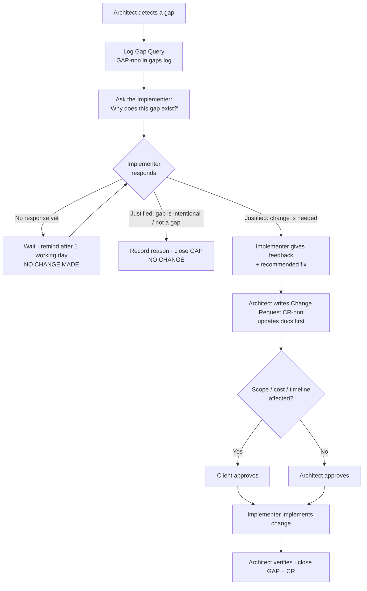

# Rules — Zoho Books Chat Assistant

| | |
|---|---|
| **Version** | 0.1 |
| **Date** | 4 October 2026 |
| **Applies to** | Everyone working on this project: the Architect, the Implementer, and any AI agent acting in either role |
| **Related docs** | `PRD.md`, `Architecture.md`, `milestones.md` |

These rules are binding. If a rule conflicts with speed or convenience, the rule wins.

---

## 1. Roles

| Role | Name | Responsibility in one line |
|---|---|---|
| **Architect** | `<Architect name>` | Owns the design and the documents; decides *what* and *how* at the design level |
| **Implementer** | `<Implementer name>` | Builds the system exactly as documented; owns *the build* and reports back |
| **Client / Product Owner** | `<Client name>` | Approves scope, priorities, and acceptance |

### 1.1 Message to the Architect

> **Architect, this is your Implementer: `<Implementer name>`.**
> The Implementer builds what you document. You do not implement, and you do not change the system on your own. Every design decision goes into the documents first. Every gap you find goes to the Implementer as a question before anything changes (see §4).

### 1.2 Message to the Implementer

> **Implementer, this is your Architect: `<Architect name>`.**
> You build only what is written in the approved documents. If something is unclear, missing, or seems wrong, raise it with the Architect. Do not decide it silently in the build.

## 2. Responsibilities

### 2.1 Architect
1. Writes and maintains `PRD.md`, `Architecture.md`, `milestones.md`, and this file.
2. Writes a **Milestone Design Note** before each milestone starts (§3.2).
3. Defines intents, JSON schemas, the data model, the permission matrix, and acceptance criteria.
4. Reviews the Implementer's work against the documents at the end of each milestone.
5. Detects gaps and follows the **Gap Protocol** (§4); never changes things directly.
6. Keeps the ADR log (`Architecture.md` §14) and the change log (§6) up to date.
7. Does **not** write production workflows, code, or configuration.

### 2.2 Implementer
1. Builds n8n workflows, database migrations, prompts, and Zoho Books setup **as documented**.
2. Works only on the current approved milestone.
3. Raises questions or blockers within 1 working day of finding them.
4. Answers every Gap Query (§4) with a clear reason and a recommendation.
5. Commits all work to Git: workflow exports, SQL migrations, prompts, schemas.
6. Writes test evidence for every acceptance criterion (screenshots, logs, test-set results).
7. Never tests against the client's live Zoho Books organisation; uses DEV only.

### 2.3 Responsibility matrix (RACI)

R = Responsible · A = Accountable · C = Consulted · I = Informed

| Activity | Architect | Implementer | Client |
|---|---|---|---|
| PRD & scope (MoSCoW) | R/A | C | A (approves) |
| Architecture & data model | R/A | C | I |
| Milestone Design Note | R/A | C | I |
| Building workflows / DB / prompts | C | R/A | I |
| Zoho Books configuration | C | R | A (approves templates) |
| Testing & evidence | C | R/A | I |
| Milestone review & sign-off | R | C | A |
| Gap detection | R | C | I |
| Gap justification | C | R | I |
| Change approval | R/A | C (must give feedback) | A if scope or cost changes |
| UAT | C | R | A |

## 3. Documentation first — no implementation without a document

### 3.1 Project-level gate
**No implementation of any kind starts until `PRD.md`, `Architecture.md`, `milestones.md`, and `Rules.md` are marked Approved.** This includes "quick prototypes" in n8n.

### 3.2 Milestone-level gate
Before each milestone, the Architect writes a short **Milestone Design Note** (`docs/design/M<n>-<name>.md`) with:
1. Scope: which FR/NFR IDs are covered
2. Workflows to build or change (WF IDs)
3. Data model changes (tables/columns)
4. Intents and JSON schemas involved
5. Zoho Books endpoints and fields used
6. Acceptance tests (mapped to the exit criteria in `milestones.md`)
7. Risks and open questions

The Implementer reviews it and confirms "understood / questions". **Implementation starts only after this confirmation.**

### 3.3 Definition of Ready (before building a task)
- [ ] The task is traceable to an FR/NFR ID
- [ ] Inputs, outputs, and the schema are defined
- [ ] Acceptance criteria are written
- [ ] Dependencies are available (credentials, test data, Zoho config)

### 3.4 Definition of Done (before closing a task)
- [ ] Built exactly as documented, or the deviation is approved through §4/§5
- [ ] All acceptance criteria pass with evidence
- [ ] Errors are handled by WF-90; no secrets in workflow JSON
- [ ] Audit logging is in place for any write
- [ ] Exported to Git with a clear commit message referencing the FR ID
- [ ] Architect review passed

## 4. Gap Protocol — detect, ask, justify, then change

A **gap** is anything where the system, the build, or the documents don't match each other or don't cover a real need. Examples: a missing field, an unhandled error, a permission hole, a document that contradicts the build, a Zoho limitation, or a security weakness.

### 4.1 The rule
> **When the Architect finds a gap, the Architect does NOT make any change immediately.**
> The Architect first asks the Implementer **why** the gap exists.
> - If the Implementer gives a **proper justification and feedback** that confirms a change is needed, the change is made through the change process (§5).
> - If the Implementer has not given feedback, **no change is made.**
> - Without the Implementer's feedback, **nothing changes**: not the documents, not the workflows, not the configuration.

### 4.2 Steps



### 4.3 Gap Query template

```markdown
### GAP-<nnn>: <short title>
- **Found by:** Architect · **Date:** YYYY-MM-DD
- **Where:** <document section / workflow WF-xx / table / Zoho setting>
- **What I observed:** <facts only>
- **Expected (per docs):** <reference FR/NFR/Architecture section>
- **Question to Implementer:** Why is it like this?
- **Severity:** Critical / High / Medium / Low
- **Status:** Open → Awaiting Implementer → Justified (no change) / Change needed → Closed

#### Implementer response
- **Reason:** <why the gap exists>
- **Feedback / recommendation:** <keep as is / change, and how>
- **Impact if changed:** <effort, risk, other workflows>

#### Decision
- **Outcome:** No change / Change via CR-<nnn>
- **Decided by:** <name> · **Date:**
```

### 4.4 Special cases
- **Critical security or data-loss issue in PROD:** the Implementer (not the Architect) may disable the affected feature or the bot immediately to stop harm. Everything else, including the actual fix, still follows §4.2. Disabling is not changing.
- **Implementer finds a gap themselves:** they raise it as a Gap Query to the Architect, with their reason and recommendation already filled in.
- **Disagreement:** if the Architect and Implementer cannot agree within 2 working days, the Client decides.

## 5. Change process

1. Every change, however small, has a **Change Request (CR-nnn)** linked to its GAP (if any).
2. **Docs first:** the Architect updates the relevant document(s) and bumps the version before the Implementer builds.
3. A Must/Should/Could/Won't change, or a new feature, needs Client approval.
4. The Implementer builds only after the CR is marked **Approved**.
5. CR template:

```markdown
### CR-<nnn>: <title>
- **Linked gap:** GAP-<nnn> (or "new requirement")
- **Reason:** <from Implementer feedback / client request>
- **Documents updated:** <file + section + new version>
- **Build impact:** <workflows / tables / prompts>
- **MoSCoW impact:** <none / moved X from S to M ...>
- **Approved by:** <Architect / Client> · **Date:**
- **Implemented by:** <Implementer> · **Verified by:** <Architect> · **Date:**
```

## 6. Logs to keep (in the repo)

| File | Owner | Purpose |
|---|---|---|
| `docs/gaps.md` | Architect | All Gap Queries and their outcomes |
| `docs/changes.md` | Architect | All Change Requests |
| `docs/decisions.md` (or `Architecture.md` §14) | Architect | ADRs |
| `docs/design/M<n>-*.md` | Architect | Milestone Design Notes |
| `docs/test-evidence/M<n>/` | Implementer | Test results and screenshots |
| `CHANGELOG.md` | Implementer | What was released and when |

## 7. Engineering rules (non-negotiable)

1. **Confirm before write:** no code path writes to Zoho Books without a confirmed `pending_action`.
2. **LLM returns JSON only:** the LLM never calls Zoho, and totals/VAT are always recomputed by n8n.
3. **No delete by chat.** Void only.
4. **Permissions are data:** never hard-code role checks; use `role_permissions`.
5. **Tenant-aware:** every query filters by `tenant_id`; no client-specific values hard-coded.
6. **Secrets:** only in n8n credentials/env. Never in workflow JSON, Git, logs, or chat.
7. **DEV before PROD:** every change runs in DEV with the test bot and test Zoho org first.
8. **Channel separation:** domain workflows never call Telegram/WhatsApp directly; channel workflows never call Zoho directly.
9. **Prompt changes** are versioned and must re-pass the test set (≥ 90%) before release.
10. **Every write is audited** in `audit_log` with the Zoho record ID.

## 8. Communication

- **Status update:** the Implementer posts a short daily update (done / next / blockers).
- **Milestone review:** at the end of each milestone. The Architect reviews against exit criteria and the Client signs off.
- **Questions:** in writing, so they become part of the record (`docs/gaps.md` or the CR).
- **Response time:** Gap Queries and blockers are answered within 1 working day.

## 9. Sign-off

| Document | Version | Architect | Implementer | Client | Date |
|---|---|---|---|---|---|
| PRD.md | 0.1 | | | | |
| Architecture.md | 0.1 | | | | |
| milestones.md | 0.1 | | | | |
| Rules.md | 0.1 | | | | |
