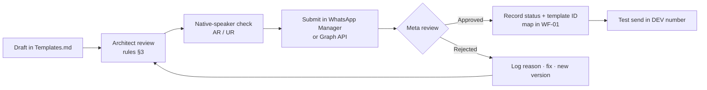

# Templates — WhatsApp Message Templates for Meta Approval

| | |
|---|---|
| **Version** | 0.1 (Draft — not yet submitted) |
| **Date** | 4 October 2026 |
| **Channel** | WhatsApp Business Platform (Cloud API) — Phase 2, milestone **M12** |
| **Owner** | Architect (wording and approval) · Implementer (submission and mapping in WF-01) |
| **Languages** | English (`en`), Arabic (`ar`), Urdu (`ur`) |
| **Related docs** | `PRD.md`, `Architecture.md` §13, `Workflows.md` (WF-00b, WF-01, WF-30), `Rules.md` |

> **Purpose:** this file holds every WhatsApp message template we submit to Meta for approval: **marketing**, **utility**, and **authentication**. It records each template's exact wording in each language, its sample values, and its approval status.
>
> **Scope reminder:** templates are sent only to the **client's own users** (business owners and staff) who have opted in. The bot does **not** message the client's end customers (`PRD.md` §5, Won't have).

---

## 1. When a template is needed

| Situation | Template needed? |
|---|---|
| The user messaged the bot within the last **24 hours** (customer service window) | **No.** Free-form replies, buttons, and PDFs are allowed |
| The bot starts a conversation, or replies **after 24 hours** of user silence | **Yes.** Only an approved template can be sent |
| Scheduled reports, alerts, and reminders (sent by WF-30/WF-93) | **Yes**, usually (they often arrive outside the window) |
| PIN reset code | **Yes.** Authentication template |
| Promotions, feature news, tips | **Yes.** Marketing template, and the user must have opted in to marketing |

## 2. Meta categories (choose correctly, or Meta will re-categorise)

| Category | Use for | Notes |
|---|---|---|
| **Utility** | Information about something the user asked for or already uses: reports, alerts, account changes | Must not contain promotional content. Usually cheaper than marketing |
| **Authentication** | One-time codes (PIN reset, login) | Fixed wording set by Meta; copy-code button |
| **Marketing** | Promotions, new features, tips, offers, re-engagement | Requires marketing opt-in; include an opt-out button; may face delivery limits |

> Pricing and delivery rules change. Check the current Meta pricing page before budgeting. A template's approved category decides its price.

## 3. Writing rules (checked before every submission)

1. **Name:** lowercase letters, numbers, and underscores only; unique per WhatsApp Business Account; never reused after deletion (add `_v2`).
2. **Variables:** positional `{{1}}`, `{{2}}`… in order. The body must **not start or end** with a variable. Avoid two variables side by side. Keep enough fixed text around them.
3. **Sample values** are required for every variable at submission (realistic, no real customer data).
4. **Limits:** header text ≤ 60 chars (1 variable max) · body ≤ 1,024 chars · footer ≤ 60 chars · quick-reply button text ≤ 25 chars · URL button ≤ 2,000 chars.
5. **No** misleading, threatening, or vague content; no full URLs shortened by third-party shorteners; no requests for passwords or card numbers.
6. **Marketing templates** include a **"Stop promotions"** quick-reply button, and WF-01 must honour it (set `marketing_opt_in = false`).
7. Same meaning in every language. Translations are reviewed by a native speaker before submission.
8. Footer brand: **EN** "Zoho Books Assistant" · **AR** "مساعد Zoho Books" · **UR** "Zoho Books اسسٹنٹ".
9. Any wording change after approval = a **new version** (`_v2`) and a CR (`Rules.md` §5).

## 4. Submission and approval process

## 5. Template register

| # | Template name | Category | Languages | Variables | Used by | Status | Meta template ID | Approved on |
|---|---|---|---|---|---|---|---|---|
| T-01 | `scheduled_report_ready` | Utility | en, ar, ur | 3 | WF-30 | Draft | | |
| T-02 | `daily_business_summary` | Utility | en, ar, ur | 6 | WF-30 | Draft | | |
| T-03 | `overdue_invoices_alert` | Utility | en, ar, ur | 4 | WF-30 | Draft | | |
| T-04 | `user_access_granted` | Utility | en, ar, ur | 3 | WF-40 | Draft | | |
| T-05 | `security_user_locked` | Utility | en, ar, ur | 2 | WF-06 | Draft | | |
| T-06 | `service_maintenance_notice` | Utility | en, ar, ur | 3 | Manual / WF-93 | Draft | | |
| T-07 | `pin_reset_code` | Authentication | en, ar, ur | 1 | WF-40 | Draft | | |
| T-08 | `feature_announcement` | Marketing | en, ar, ur | 3 | Manual campaign | Draft | | |
| T-09 | `monthly_productivity_tip` | Marketing | en, ar, ur | 2 | Manual campaign | Draft | | |
| T-10 | `trial_ending_reminder` | Marketing | en, ar, ur | 2 | SaaS (M15) | Draft | | |
| T-11 | `we_miss_you` | Marketing | en, ar, ur | 2 | Manual campaign | Draft | | |

**Status values:** Draft → In review (internal) → Submitted → Approved / Rejected → Paused / Disabled (by Meta quality rating) → Retired

---

## 6. Utility templates

### T-01 `scheduled_report_ready`
- **Category:** Utility · **Header:** Document (the report PDF/XLSX) · **Buttons:** none
- **Variables:** `{{1}}` user name · `{{2}}` report name · `{{3}}` period
- **Samples:** `Ahmed` · `Profit & Loss` · `September 2026`

| Lang | Body | Footer |
|---|---|---|
| en | Hello {{1}}, your {{2}} report for {{3}} is ready. The file is attached to this message. | Zoho Books Assistant |
| ar | مرحباً {{1}}، تقرير {{2}} الخاص بفترة {{3}} جاهز. الملف مرفق بهذه الرسالة. | مساعد Zoho Books |
| ur | السلام علیکم {{1}}، {{3}} کی {{2}} رپورٹ تیار ہے۔ فائل اس پیغام کے ساتھ منسلک ہے۔ | Zoho Books اسسٹنٹ |

### T-02 `daily_business_summary`
- **Category:** Utility · **Header:** Text: "Daily summary" / "الملخص اليومي" / "روزانہ خلاصہ"
- **Variables:** `{{1}}` name · `{{2}}` date · `{{3}}` sales · `{{4}}` payments received · `{{5}}` unpaid invoices · `{{6}}` expenses
- **Samples:** `Ahmed` · `4 Oct 2026` · `AED 12,500.00` · `AED 8,000.00` · `AED 21,300.00` · `AED 1,250.00`
- **Buttons (quick reply):** EN "Unpaid invoices" · "Full report" | AR "الفواتير غير المدفوعة" · "التقرير الكامل" | UR "غیر ادا شدہ انوائسز" · "مکمل رپورٹ"

| Lang | Body |
|---|---|
| en | Good morning {{1}}. Here is your business summary for {{2}}: Sales: {{3}} Payments received: {{4}} Unpaid invoices: {{5}} Expenses: {{6}} Reply with any question to see the details. |
| ar | صباح الخير {{1}}. إليك ملخص أعمالك ليوم {{2}}: المبيعات: {{3}} المدفوعات المستلمة: {{4}} الفواتير غير المدفوعة: {{5}} المصروفات: {{6}} أرسل أي سؤال لعرض التفاصيل. |
| ur | صبح بخیر {{1}}۔ {{2}} کا کاروباری خلاصہ یہ ہے: سیلز: {{3}} موصول شدہ ادائیگیاں: {{4}} غیر ادا شدہ انوائسز: {{5}} اخراجات: {{6}} تفصیل دیکھنے کے لیے کوئی بھی سوال بھیجیں۔ |

### T-03 `overdue_invoices_alert`
- **Category:** Utility · **Header:** none
- **Variables:** `{{1}}` name · `{{2}}` number of overdue invoices · `{{3}}` total overdue · `{{4}}` days overdue (oldest)
- **Samples:** `Ahmed` · `4` · `AED 15,750.00` · `38`
- **Buttons (quick reply):** EN "Show overdue list" · "Remind me tomorrow" | AR "عرض القائمة" · "ذكّرني غداً" | UR "فہرست دکھائیں" · "کل یاد دلائیں"

| Lang | Body |
|---|---|
| en | Hello {{1}}, you have {{2}} overdue invoices with a total of {{3}}. The oldest one is {{4}} days overdue. |
| ar | مرحباً {{1}}، لديك {{2}} فواتير متأخرة السداد بإجمالي {{3}}. أقدمها متأخرة منذ {{4}} يوماً. |
| ur | السلام علیکم {{1}}، آپ کی {{2}} انوائسز کی ادائیگی کی تاریخ گزر چکی ہے، جن کی کل رقم {{3}} ہے۔ سب سے پرانی انوائس {{4}} دن سے واجب الادا ہے۔ |

### T-04 `user_access_granted`
- **Category:** Utility · **Header:** none
- **Variables:** `{{1}}` new user's name · `{{2}}` role (Owner/Staff) · `{{3}}` company name
- **Samples:** `Sara` · `Staff` · `Al Noor Consulting`
- **Buttons (quick reply):** EN "Get started" | AR "ابدأ الآن" | UR "شروع کریں"

| Lang | Body |
|---|---|
| en | Hello {{1}}, you now have {{2}} access to the accounting assistant for {{3}}. Tap "Get started" to set your PIN and see what you can do. |
| ar | مرحباً {{1}}، تم منحك صلاحية {{2}} في المساعد المحاسبي لشركة {{3}}. اضغط "ابدأ الآن" لتعيين رمزك السري ومعرفة ما يمكنك القيام به. |
| ur | السلام علیکم {{1}}، آپ کو {{3}} کے اکاؤنٹنگ اسسٹنٹ تک {{2}} رسائی دے دی گئی ہے۔ اپنا PIN سیٹ کرنے اور سہولیات دیکھنے کے لیے "شروع کریں" دبائیں۔ |

### T-05 `security_user_locked` (sent to the Owner)
- **Category:** Utility · **Header:** Text: "Security alert" / "تنبيه أمني" / "سیکیورٹی الرٹ"
- **Variables:** `{{1}}` user name · `{{2}}` time
- **Samples:** `Sara` · `4 Oct 2026, 10:42`
- **Buttons (quick reply):** EN "Unlock user" · "Keep locked" | AR "إلغاء القفل" · "إبقاء القفل" | UR "ان لاک کریں" · "بند رہنے دیں"

| Lang | Body |
|---|---|
| en | Security notice: {{1}} was locked out of the accounting assistant at {{2}} after too many wrong PIN attempts. If this was not expected, please review their access. |
| ar | تم إيقاف وصول {{1}} إلى المساعد المحاسبي في {{2}} بعد عدة محاولات خاطئة لإدخال الرمز السري. إذا لم يكن ذلك متوقعاً، يرجى مراجعة صلاحياته. |
| ur | کئی بار غلط PIN درج کرنے کی وجہ سے {{2}} پر {{1}} کی اکاؤنٹنگ اسسٹنٹ تک رسائی بند کر دی گئی ہے۔ اگر یہ غیر متوقع ہے تو براہِ کرم ان کی رسائی کا جائزہ لیں۔ |

### T-06 `service_maintenance_notice`
- **Category:** Utility · **Header:** none
- **Variables:** `{{1}}` date · `{{2}}` start time · `{{3}}` end time
- **Samples:** `Saturday 10 Oct 2026` · `01:00` · `03:00`

| Lang | Body |
|---|---|
| en | Service notice: the accounting assistant will be unavailable on {{1}} from {{2}} to {{3}} (UAE time) for scheduled maintenance. Your Zoho Books data is not affected. |
| ar | إشعار خدمة: سيكون المساعد المحاسبي غير متاح يوم {{1}} من الساعة {{2}} إلى {{3}} (بتوقيت الإمارات) بسبب صيانة مجدولة. بياناتك في Zoho Books لن تتأثر. |
| ur | سروس نوٹس: طے شدہ مینٹیننس کی وجہ سے اکاؤنٹنگ اسسٹنٹ {{1}} کو {{2}} سے {{3}} بجے (یو اے ای وقت) تک دستیاب نہیں ہوگا۔ آپ کا Zoho Books ڈیٹا متاثر نہیں ہوگا۔ |

---

## 7. Authentication template

### T-07 `pin_reset_code`
- **Category:** Authentication · **Code delivery:** Copy code button
- **Options to enable:** ☑ Add security recommendation · ☑ Add expiry time: **10 minutes**
- **Variable:** `{{1}}` one-time code · **Sample:** `482913`
- **Wording:** Meta provides **fixed preset text** for authentication templates in each language (e.g. EN "*{{1}}* is your verification code. For your security, do not share this code. This code expires in 10 minutes."). Custom wording is not allowed. Select languages `en`, `ar`, `ur` in WhatsApp Manager.
- **Use:** only for PIN reset, after the Owner has approved the reset (WF-40). The code expires in 10 minutes, can be used once, and is stored only as a hash.

---

## 8. Marketing templates

> Send only to users with `marketing_opt_in = true`. Every marketing template has a **"Stop promotions"** button; WF-01 turns opt-in off immediately when it is pressed. Campaigns are approved by the client before sending.

### T-08 `feature_announcement`
- **Category:** Marketing · **Header:** Text: "New feature" / "ميزة جديدة" / "نئی سہولت"
- **Variables:** `{{1}}` name · `{{2}}` what they can now do · `{{3}}` example message to try
- **Samples:** `Ahmed` · `record supplier bills from a photo` · `Add bill from this photo`
- **Buttons (quick reply):** EN "Try it now" · "Stop promotions" | AR "جرّبها الآن" · "إيقاف العروض" | UR "ابھی آزمائیں" · "پروموشن بند کریں"

| Lang | Body |
|---|---|
| en | Hello {{1}}, you can now {{2}} directly from your chat. Try it today by sending: "{{3}}". |
| ar | مرحباً {{1}}، يمكنك الآن {{2}} مباشرة من المحادثة. جرّبها اليوم بإرسال: "{{3}}". |
| ur | السلام علیکم {{1}}، اب آپ چیٹ سے براہِ راست {{2}} کر سکتے ہیں۔ آج ہی آزمائیں، یہ پیغام بھیجیں: "{{3}}"۔ |

### T-09 `monthly_productivity_tip`
- **Category:** Marketing · **Header:** Text: "Tip of the month" / "نصيحة الشهر" / "اس ماہ کی ٹِپ"
- **Variables:** `{{1}}` name · `{{2}}` tip text
- **Samples:** `Ahmed` · `send a voice note like "invoice Al Noor 3 hours consulting" and the assistant prepares the draft for you`
- **Buttons (quick reply):** EN "More tips" · "Stop promotions" | AR "نصائح أخرى" · "إيقاف العروض" | UR "مزید ٹپس" · "پروموشن بند کریں"

| Lang | Body |
|---|---|
| en | Hello {{1}}, here is this month's tip to save time with your accounting assistant: {{2}}. Reply "Tips" anytime to see more. |
| ar | مرحباً {{1}}، إليك نصيحة هذا الشهر لتوفير الوقت مع مساعدك المحاسبي: {{2}}. أرسل "نصائح" في أي وقت لمعرفة المزيد. |
| ur | السلام علیکم {{1}}، اکاؤنٹنگ اسسٹنٹ کے ساتھ وقت بچانے کے لیے اس ماہ کی ٹِپ: {{2}}۔ مزید ٹپس کے لیے کسی بھی وقت "Tips" بھیجیں۔ |

### T-10 `trial_ending_reminder` *(SaaS phase — M15)*
- **Category:** Marketing · **Header:** none
- **Variables:** `{{1}}` name · `{{2}}` trial end date
- **Samples:** `Ahmed` · `15 November 2026`
- **Buttons:** URL "View plans" → `https://<your-domain>/plans` · quick reply "Stop promotions"
- **AR buttons:** "عرض الباقات" · "إيقاف العروض" · **UR buttons:** "پلانز دیکھیں" · "پروموشن بند کریں"

| Lang | Body |
|---|---|
| en | Hello {{1}}, your free trial of the accounting assistant ends on {{2}}. Subscribe before then to keep creating quotes, invoices and reports from your chat. |
| ar | مرحباً {{1}}، تنتهي فترتك التجريبية المجانية للمساعد المحاسبي في {{2}}. اشترك قبل ذلك لتواصل إنشاء عروض الأسعار والفواتير والتقارير من المحادثة. |
| ur | السلام علیکم {{1}}، اکاؤنٹنگ اسسٹنٹ کا آپ کا مفت ٹرائل {{2}} کو ختم ہو رہا ہے۔ چیٹ سے کوٹیشنز، انوائسز اور رپورٹس بناتے رہنے کے لیے اس سے پہلے سبسکرائب کریں۔ |

### T-11 `we_miss_you`
- **Category:** Marketing · **Header:** none
- **Variables:** `{{1}}` name · `{{2}}` new things added since last use
- **Samples:** `Ahmed` · `scheduled reports and supplier bills`
- **Buttons (quick reply):** EN "Show me" · "Stop promotions" | AR "أرني" · "إيقاف العروض" | UR "دکھائیں" · "پروموشن بند کریں"

| Lang | Body |
|---|---|
| en | Hello {{1}}, we haven't seen you in a while. Since your last visit we have added {{2}}. Send "Help" to pick up where you left off. |
| ar | مرحباً {{1}}، لم نرك منذ فترة. منذ زيارتك الأخيرة أضفنا {{2}}. أرسل "مساعدة" لتكمل من حيث توقفت. |
| ur | السلام علیکم {{1}}، کافی عرصے سے آپ سے ملاقات نہیں ہوئی۔ آپ کی پچھلی آمد کے بعد ہم نے {{2}} شامل کیا ہے۔ جہاں چھوڑا تھا وہیں سے شروع کرنے کے لیے "Help" بھیجیں۔ |

---

## 9. Opt-in and data rules

| Rule | Implementation |
|---|---|
| Utility/authentication messages | Only to active users in `users` (allow-list) |
| Marketing opt-in | Explicit yes from the user (button or written consent), stored with date; add `marketing_opt_in` + `marketing_opt_in_at` to `users` via CR before M12 (`Database.md`) |
| Opt-out | "Stop promotions" button or the words STOP / إيقاف / بند → opt-in off immediately; confirmation sent |
| Quality rating | Watch the template quality rating in WhatsApp Manager weekly; pause any template that drops to Low |
| Frequency cap | Max 1 marketing message per user per week (client may lower it) |

## 10. Rejection log

| Date | Template | Version | Meta reason | Fix | Re-submitted |
|---|---|---|---|---|---|
| | | | | | |

## 11. Change history

| Version | Date | Change | CR | By |
|---|---|---|---|---|
| 0.1 | 2026-10-04 | Initial set: 6 utility, 1 authentication, 4 marketing templates (EN/AR/UR) | — | Architect |
